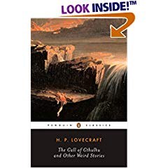
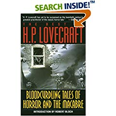

A few days ago, on the 10th of May to be precise, a book edition of the webcomic [Inverloch](http://seraph-inn.com) has been released. I've been a great fan of the webcomic version for quite some time now and I can hardly wait for the bookstore through which I've ordered the book to receive it, supposedly this will be two weeks after release... we shall see.  
  
Also during this week and weekend I have discovered two wonderful webcomics that have urgently been added to the quite extensive list of webcomics I read regularly. They are [wullforgenthaler](http://www.wulffmorgenthaler.com/) and [Pewfell](http://www.pewfell.com), both provided hours upon hours of entertainment as I struggled to read through the archives.  
  
One of the greatest thing that happened on Saturday was that the two books from H. P. Lovecraft that I've ordered have arived and I picked them up. It has been quite a drought without any fresh reading material but this should prove to provide quite some reading time until they are finished with. Two lovely collections of short stories with some of Cthulhu, these are the ones I'm most interested in at the moment.  
  

