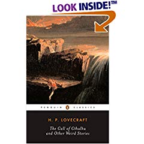

Pred nekaj dnevi, natančneje 10. maja, je izšla prva knjižna izdaja spletnega stripa [Inverloch](http://www.seraph-inn.com), ki ga v njegovi spletni obliki spremljam že kar nekaj časa. Težko pričakovana knjižna verzija prve knjige bi mroala prispeti v knjigarno, preko katere sem knjigo naročil, v dveh tednih od izdaje... le upamo lahko da bo temu res tako.  
  
V tem tednu sem odkril dva nova spletna stripa, ki sta odlična za branje in sem za branje celotnega arhiva porabil kar nekaj časa. Oba sta bila hitro dodana med dolg spisek spletnih stripov, ki jih redno spremljam. Se pravi [wullfmorgenthaler](http://www.wulffmorgenthaler.com/) in [Pewfell](http://www.pewfell.com) sta dva odlična stripa, ki ju mora vsakdo prebrati.  
  
Z veseljem tudi sporočam, da sem v soboto končno dobil dve knjigi H. P. Lovecrafta, ki sem ju naročil. Brez materiala za branje je bila v tednu kar suša tole pa bi moralo težave odlično pozdraviti. Knjigi sta v bistvu zbirki njegovih novel, kar naj bi bil najbolj primeren način za začetek raziskovanja tako ekstenzivnega opusa.  

  
