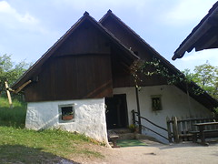

Včeraj smo s familijo šli na ekspedicijo, lahko rečete izlet ampak imam raje ekspedicije, do Golice in se nenavadno zabavali. Vse skupaj je bilo poplačano z dvema ogromnima zrezkoma, ki sem ju dobil za kosilo. Te vaške gostilne res nimajo oblutka za velikost mešÄanskega želodca in koliko prenese, ampak prenesel je vse in trpel še cel dan.

Ogledali smo si še rojstni hiši dveh literatov, Franceta Prešerna in Frana S. Bevka, ki sta še vedno ravno tako zanimivi, kot sta bili pred leti. Mnogim ogled takih hiš ni zanimiv, mene pa prav zabava. Najbolj sem bil presenečen, ko sem končno izvedel zakaj vraga so včasih imeli črne kuhinje. Izkaže se,d a če pustimo dimu, da prehaja skozi kuhinjo se tam dovolj ohladi, da ne zažge slamnate strehe.

Sličica vas pripelje še do več slik na Flickerju.

