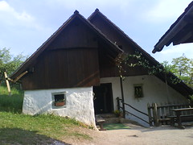

Yesterday the family and I went on a little expedition, you may call it a family trip if you want but I prefer expeditions. It was strangely pleasurable and payed off in full with the two huge steaks I had for lunch. Village restaurants realyl have no feeling for the poor city stomach and how much it can wisely take. But I took it all.

We also wen to see two literaty birth houses, namely France Prešeren and Fran S. Bevk. Both valuable contributors to Slovene literature. What surprised me the most was finalyl getting to know why exactly the black kitchens were made to be black. Apparently by letting the smoke go through the kitchen rathe than straight to the chimney it cooled off and there was less of a chance for fire in the roof.

The following photo links to a photoset on Flickr.

