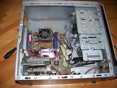
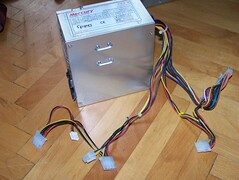
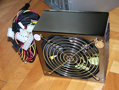
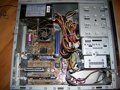

On Friday, about four days ago, I woke up to a quiet room - something I am not used to at all. At first I thought what the hell was going on that the music stopped playing during the night, but figured I must've used some alternative sound producing technique and it ran out of juice during the night (like a film for example).

The grizzly truth became apparent all too quickly though. The power supply of my computer had been choked by dust and was beyond help. As soon as I got to work I ordered a new one, but had to wait until today to receive it and promptly install it.

This is what my box looks like without a power supply:

This is what the old power supply looks like, quite dead I'm afraid:

The new power supply with a huge fan:

And the nicely wired, newly powered box:

