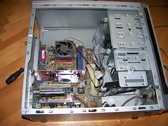
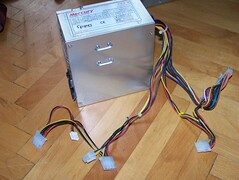
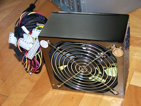
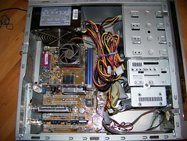

V petek sem se prebudil v tišino - nekaj česar nisem vajen. Sprva sem se zaćudil zakaj vraga se je glasba ponoči spet ugasnila in se kmalu odločil, da sem menda uporabil alternativen izvor zvoka, ki se je ponoči izsušil (na primer film).

Strašna resnica je postala še prekmalu očitna. Računalnikov napajalnik se je ponoči zadušil v prahu in mu ni bilo več pomoči. ÄŒim sem prispel na delo, sem naročil novega in ga moral čakati do danes, ko je bil takojci namešÄen.

Takole stvar izgleda brez napajalnika:

Precej mrtvi stari napajalnik:

Novi z ogromnim ventilatorjem:

Takole pa izgleda, ko je vse sestavljeno in uporabno:

