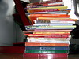

Over the weekend I cleaned my room. During this quite annoying task I happened to come upon all the school books I won't ever be needing again and put them on a pile. The result was quite baffling since the pile stands more than half a meter tall ... and colourful. The above photo is of this pile before I found even some more books.

It's really quite surprising to realise just how many books will accumulate through high school and just how much money is pumped into them, no wonder so many people swear to used books instead of new. Sure I bought some used books, but I've always prefered the swanky smell of fresh ones. There's just something about a fresh book that feels awesome.