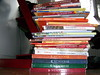

ÄŒez viken sem pospravljal sobo. Med tem kar nadležnim opravilom sem odkril vse stare šolske knjige, ki jih ne bom nikoli več potreboval, in jih postavil na kup. Rezultat je sapo jemajoč, saj se kup bohoti z več kot pol metra in ... veliko pisanostjo. Zgornja fotografija je nastala nekaj pred odkritjem še več učbenikov.

Res je kar presenetljivo koliko se pravzaprav nabere učbenikov v trajanju ene srednje šole in koliko denarja stočimo vanje. Ni čudno, da nekateri prisegajo na kupovanje rabljenih. Res je, tudi sam sem kupil prenekateri rabljen učbenik, a mi je bil vedno ljubši vonj novih. Nekaj prav čudovitega je na sveži knjigi.