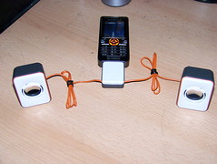

A few days ago I got a shiny box at work and I did want to blog about it sooner, but alas there was too much drowning in work to be done. However, here are some photos of the shiny box in question.

This is what the box looked like when untampered with and completely virgin.

Then it revealed its foamy insides and the fact that promotional material is always packaged super big.

The speakers played with my cell phone very well and they all got along superbly fine. Frankly. everyone with this kind of phone should get a set of miniature mobile speakers.

