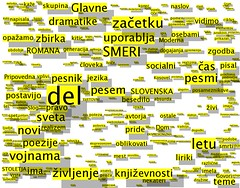

The thumbnail links to a full size image. What is this image you might ask, well I might just tell you.

The image contains a tagcloud, a summary in essence, of all literature stuff taught in the fourth year of high school. It was generated with a piece of software I've been developing practically all summer and revolves around text analysis. It's pretty sweet and I'm actually paid to do it, which makes it even sweeter. Its biggest attribute is the cutting edge user interface that is right up there with google, flickr and the likes as far as awesomeness go, except mine is perhaps a bit higher still.

I might get into a bigger ramble about the interface when everything is complete, or I might not, have become very lazy about blogging lately. However, the high school chapter of my life is closed and using high school content for software testing is not at all daunting and painful anymore.