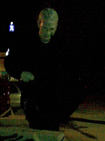
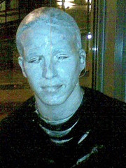
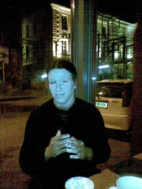
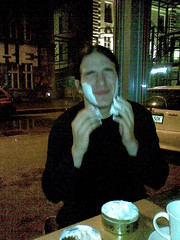

Firstly I should admit that I have been neglecting this blog horribly and I shall need to try to fix this new bad habbit of not blogging stuff. I will give it my best and honest attempt to get back into the habbit of blogging near daily. With all the interesting and uninteresting things that get written by that logic.

Yesterday was halloween and even though it's not really much of a tradition around these parts yet it's steadily gaining pace. As a result of a very silly decision I decided to actually dress up, something which I haven't done for any occasion in many years. I, of course being myself, needed something original and wholy interesting, but it also needed a flare of art and science behind it.

So I went as a living statue. The makeup was quite easy to create, but I shall use something store bought next time. Standing still is strangely entertaining as well and you know what, people do actually look and observe and are totally bewildered by why someone would be doing such a thing instead of partying and drinking. Only one things though, it was really really cold out and I couldn't feel my hands very soon. Think I managed to be a statue for about 30 minutes before I got dragged kicking and screaming to go partying with some people.

Here are some photos.

