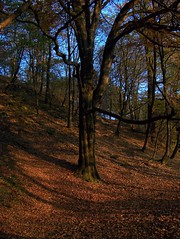

A few days ago I went on a little stroll through some autumny woods with the sole intention of photographing. It's been much too long since I did anything like artsy photography of this sort and I must say it's still a very pleasurable activity. However I did miss the abilities of my old Zenit analog camera, especially how it takes crisp pictures even in bad lighting ... unlike this crappy modernity of digitalisation. The sadly weak sensor ruined much too many of my pictures.

Out of 140 taken, here's some that I feel are decent enough to be shown.

