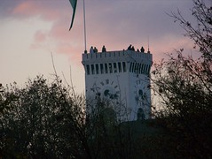

Pred nekaj dnevi sem šel na sprehod čez jesenski grad z edinim namenom fotografiranja. Dolgo je že od kar sem se ukvarjal s čimerkoli podobnim umetniški fotografiji te branže in moram reči, da je še vedno zelo zabavno. Pogrešam pa fleksibilnost svojega starega Zenita, še postebno njegove sposobnosti slikanja čistih in ostrih slik v slabi svetlobi ... ne pa tako kot te moderni digitalci. Žalostno švohoten senzor je pokvaril vse preveč slik.

Od 140 posnetih slik jih je tu nekaj dovolj solidnih za prikaz.

