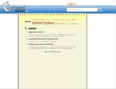

Yesterday was far more productive than it should be (in that I did nearly everything other than studying as I was supposed to). My pet project that is destined to launch me into the rich and powerful stratosphere (looking from the perspective of a worm) [urbanislovar.org](http://urbanislovar.org/) has finally received that final significant boost into marginal usability it was waiting for since something like October or even September.

That's right, tags have been added. Each word can be tagged by any user of the website and a tagcloud is formed that shows the \\importance of a tag. Basically its size shows how oft said word has been tagged by a certain tag and the tag's opacity shows to how many different words it pertains. All in all a very useful tool and it even managed to look quite attractive. I'm almost proud.

I say this is the final boost into marginal usability because the project has finally reached a stage where I will not erase the database anymore, which I did often before because the structure would change and testing was going on and stuff. It also got transfer to a real host, because everyone tries harder once they're paying for the hosting of a project ... especially myself.

So in the next few weeks or, which is more probable, months the project will slowly take on new features and reach to that final stage where it can begin being properly advertised with a campaign I've been planning since autumn. I think it's safe to say the project will be officially launched come May.

And here's what the tags look like:

