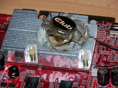
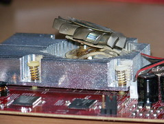
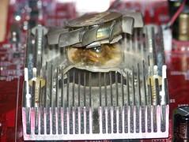

A dear friend of mine died today. We've been together since the early days of the broadband age and he's helped me through a lot of hard times and bad days and I have always been there for him when he needed my assistance. He was also there for me whenever I felt like having a light chat, or even a in depth discussion on why the grass is greener on the other side. Lestat was his name and he did not care when I was neglecting him to entertain a girl. He was awesome enough to watch me play a video game or do my work without trying to get in my way. Honestly, it was more often me who broke off something I was supposed to be doing in order to spend quality time with him, he was never a distraction on his own.

And today Lestat perished in a heated dramatic event. His graphics card decided to spew out a fan and overheat. I'm not sure how it happened, but I do know the thing is under warranty. The problem is that AGP graphics cards are not made anymore and so I could be left stranded. Having to buy a new one would mean also buying a new motherboard, CPU, RAM and HDD. All that would remain of my Lestat (even though nothing of the originally original computer residing in that box remains) would be the power supply and sound card. Would I even still be able to call the new guy Lestat? Would he be able to provide the same kind of support and friendship? And most of all, can I even afford it?

e2a35b58847b4cd37f94c911602529f9