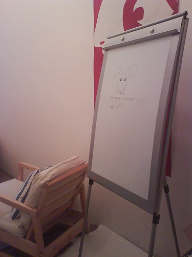

Got a new whiteboard at work yesterday. Often been needing one, but since I didn't have one of my own I was left hanging and had to rely on mental imagery, which tends to take a little longer because the mind often drifts, loses focus, and it's a general pain in the arse having to think so hard as to see a large algorithm in your head.

The board came in a large package and it was like christmas all over, but somehow I managed to restrain myself to opening it only after I'd finished most of my work. The huge huge bubblewrap ... thing ... I took home and had my way with it. Those things are awesome!