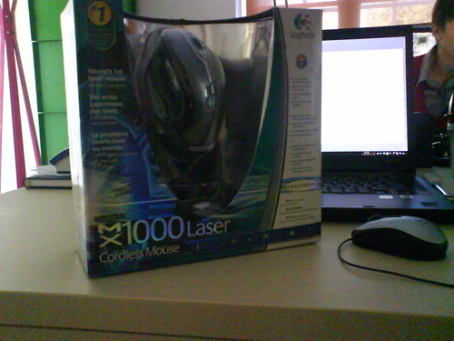
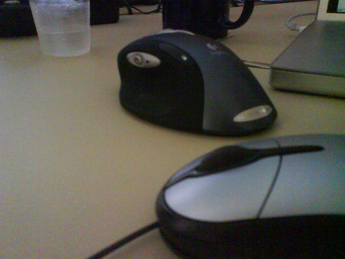
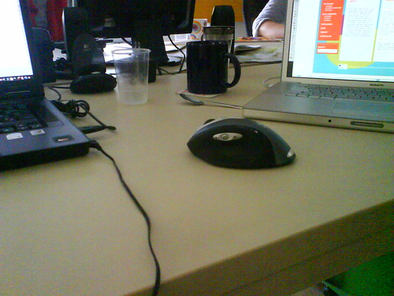

Two weeks ago I began noticing a special kind of pain in my hand that didn't mean anything good. At first I thought maybe I sprained it, but for the life of me couldn't figure out when or how and simply went on suffering. But one day last week at work it dawned on me, it wasn't a sprain at all, it was pain resulting from an inferior mouse I've been using at work. It was a little next-to-laptop gizmo, meant for quick and infrequent use and because it was so damned small I was straining my thumb too much holding it.

Complained about it to my boss and he said I could get a new one, just had to find a link. So I did and went on suffering ... it even got so bad this weekend that I could barely lift a cup of tea without tears welling up in my eyes from the pain. Then Monday came and I was stuck with the stupid mouse, so what I did was try as much as I could not to hold it but only have my hand layed on it leisourly. It felt gay, but it worked, the pain ceased.

BUT! Today I got a new mouse, a spanky MX1000 that is so far seeming very ergonomic and like it will mark the end of all my woes and silly compromises with mouse holding. I have work to do, I shouldn't have to keep thinking about how I hold my mouse so it doesn't kill me. So because I felt especially awesome with the new mouse, here's some comparison shots and what my desk looks like now.

