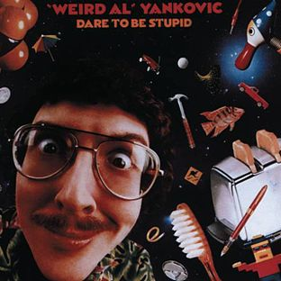

- 

  Image via [Wikipedia](http://en.wikipedia.org/wiki/Image:Weird_Al_Yankovic_-_Dare_to_Be_Stupid.jpg)

So today I finally got sick and tired of using the blogging platform I'd developed ontop of my framework, because while it's alright for a lot of things like extreme flexibility and so on it does have its quirks ... like me not being able to do too many fancy things since they haven't been developed and the fact that wherever I turn there's a possible improvement staring me right in the face.

And so I decided to move my whole body of posts to a much better platform - wordpress. Moving all the data went surprisingly simply and there wasn't too much work in translating posts. I even managed to preserve all the tags and whatnot so no content was lost. What's even better, since wordpress allows different types of permalinks I was able to preserve any and all inbound links that might be floating around the web.

On a darker side I lost all images I'd ever uploaded to the previous platform due to my stupidity in deleting a directory I shouldn't have. Of course there was no backup and the lovely FTP client doesn't offer an undo for such serious actions.

Using wordpress will also allow me to poke around the [Zemanta](http://www.zemanta.com "Zemanta") plugin so I can see if it's really as great as they keep telling me it is. So far I've only ever seen in it in action on [Jure Cuhalev](http://www.jurecuhalev.com/blog "Jure Cuhalev")'s blog where it seemed ... somewhat quirky. Will see how it performs in my neck of the woods.

Most of you probably don't miss my old custom made design that I toiled with for many hours, but I do. So at some point in the future, most probably next weekend, I will bring some of it back with a vengence. Just you wait.

[![Reblog this post \[with Zemanta\]](http://img.zemanta.com/reblog_e.png?x-id=3a41f717-f8b8-401f-ad3d-439c38d97552)](http://reblog.zemanta.com/zemified/3a41f717-f8b8-401f-ad3d-439c38d97552/ "Zemified by Zemanta")