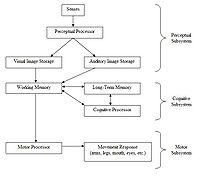

- 

  Image via [Wikipedia](http://commons.wikipedia.org/wiki/Image:Einstein1921_by_F_Schmutzer_2.jpg)

As developers we often berate our users for being stupid, even go so far as making up sayings to make it easier; what's more, we even employ some very smart people and proverbs about stupidity to aid us in our cause to make fun of the stupid (l)users:

- Human stupidity is nonconvergent - it has no limit
- Two things are infinite: the universe and human stupidity; and I'm not sure about the universe.
- No matter how idiot proof you make something, humanity/evolution will always provide a better idiot
- PEBCAK/PEBKAC Error "problem exists between chair and keyboard" - [ID10T](http://en.wikipedia.org/wiki/ID-Ten-T_Error "ID-Ten-T Error") Error (via @foulbastard)
- Or [PICNIC](http://en.wikipedia.org/wiki/PEBKAC "PEBKAC"). Problem In Chair Not In Computer (via @kapkap)
- no system, no matter how greatly developed, is resistant against dumb pulling off switch (via @Rokrca)

But let me ask you something, are you as a developer absolutely certain that the user is stupid and the fault doesn't lie with your software? Can you prove without a doubt that what you developed is perfect and the Stupid User is just too idiotic to learn how to use your brilliant work?

## <!--more-->

## There are no stupid users, just useless tools

- 

  Image via [Wikipedia](http://commons.wikipedia.org/wiki/Image:HumanProcessorModel.jpg)

An old saying goes, or maybe I just made it up, that _The tool is only as good as the person using it,_which seems like a terrible example to use, but hear me out. Notice that it doesn't say the tool is good, neither does it say that the tool is brilliant, it says the tool is used. So if a tool is only as good as the person using it and your tool is impossible to use, doesn't that in effect mean that the tool is quite simply useless? See, the thing with software is that yes, you find it extremely simple, yes you've thought of everything (or so you think) and yes, you can't understand what people find so hard about it. But the thing is, if a person can't use something, they won't. It doesn't matter how brilliant you are, it doesn't even matter how well thought-out your algorithm is and that it uses two petaflops less than it could. If its interface can only be used by a rocket scientist and even then only after ten weeks of training that means **you fail.** Users don't actually care about performance, most of them can't tell poor performing software from a well performing software. All they care about is "Can I use it?" and if the answer to that question is No then they will move to a competitor that might cost a bit more or might be a bit slower. In fact the only time real users care about performance is when it affects usability.

## We are all stupid users

Next time you make light fun of stupid users who have managed to uncover an error message you put in for fun "because no-one would be so stupid to make that sequence of actions" or when you make fun of people for not understanding how to do X in dialog Y and how on earth they could get confused about a modal dialog ... you get the picture. Well next time that happens, stop for a moment and think: _How often am I the stupid user?_Chances are the answer is Quite frequently. We all hit snags when somebody forgets to think about usability somewhere, or puts performance/design/whatever before their users. We all know that one (or more) website where it's easier to just use the search box than prowl around for what you need. We all go WTFLOL when a weird dialog box pops up. And we've all been forced into a situation where a sequence of actions needed to do something simply wasn't logical at all (think VCR's and most cell phones) So does that make us stupid (l)users? Yes, how could it not, there was a piece of brilliant software just like we make every day and we couldn't use it ... but not actually, it justs shows we're all users first and developers/geniuses later. Think about it, you seemed very stupid to your maths teacher in high school or wherever, but they would never berate you like that since they're there to teach, not to gloat.

## Teach and reflect

But what can we do to make our users less stupid? Well the obvious solution is to once in a while think like them even if it's hard. Try to forget everything months of experience in testing has brought and see what a novice user would do. Set up girlfriend tests and find some dope who has no idea what X is and just watch them using your software. Do they find everything? Are they filled with questions, or can they do pretty much everything they want intuitively? Most of all, when developing always keep in mind: _"Could I use it if I weren't using it all the time?"_ Better yet, make it so your interface is automatically teaching its users what to do. When they figure out an action all subsequent actions should follow the same mould. Consistency and discoverability are key. A feature the user can't discover is a feature that doesn't exist.

## Conclusion

For conclusion let me condense this whole post into a lovely little soundbyte: There are no stupid users, just clueless developers.

###### Related articles by Zemanta

- [BSOD Error Reporting: boost the error reporting user experience of your websites.](http://www.90percentofeverything.com/2009/03/12/bsod-error-reporting-boost-the-error-reporting-user-experience-of-your-websites/) (90percentofeverything.com)

[![Reblog this post \[with Zemanta\]](http://img.zemanta.com/reblog_e.png?x-id=a4e997fb-c78f-452d-be4d-afff7b41df05)](http://reblog.zemanta.com/zemified/a4e997fb-c78f-452d-be4d-afff7b41df05/ "Zemified by Zemanta")