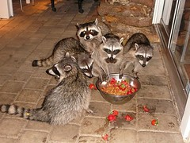

- 

  Image by [alasam](http://www.flickr.com/photos/24176761@N00/1433850718) via Flickr

Some recent morning, let's call him Monday, I woke up with an odd feeling in my throat. Upon swallowing ... anything ... the feeling was somewhat weird, as if there was something obstructing the passageway and making the activity more difficult than it was ever meant to be.

Upon further inspection I discovered an odd shaped lump on the side of my neck. So I thought to myself, _"what the flying fuck is this!?"_even though the answer had already been crystal clear to me; sometime during the night an angry [raccoon](http://en.wikipedia.org/wiki/Raccoon "Raccoon"), we'll call him Jose, crawled into my mouth to find warmth and moisture not unlike a hug so he could calm down a little bit before getting back to his wife, with which he was having a row.

But Jose never did execute his plan unto completion. Oh no, he suffocated. Jose died in my mouth because of the horrible night breath we humans have, yes we all do, not just me, you have it too and please don't ask me to test this fact for you. Ask your wife, girlfriend or boyfriend, whichever you like. Just not me.

Yesterday, or was it the day before?, I went to a lovely pharmacist, we'll call her Anna Maria Jose Elisabetha The Third And A Half, and asked if she had some herb or medicine, powder or potion, that could help with the dead raccoon lodged in my throat. To this Anna Maria Jose Elisabetha The Third And A Half rolled her eyes and said cautiously _"Alas, kind sir, you usually need a doctor's prescription for thos things, there is naught that I could give you just [over the counter](http://en.wikipedia.org/wiki/Over-the-counter_drug "Over-the-counter drug") like this"_ and what else was I to do than merely ask Anna Maria Jose Elisabetha The Third And A Half for somethingthat would soothe the pain and whatnot?

So she gave me a licky pill of antiseptic for me to suck upon and ... in general make naughty with inside my mouth. And I did, I was naughty with that pill good!

In fact, being naughty with the pills was so efficient that after two days, that is to say today, there is only a tiny dead squirrel now lodged in my throat. Yay!

[![Reblog this post \[with Zemanta\]](http://img.zemanta.com/reblog_e.png?x-id=8db47d6c-2197-40fa-ace1-a980c94a715e)](http://reblog.zemanta.com/zemified/8db47d6c-2197-40fa-ace1-a980c94a715e/ "Zemified by Zemanta")