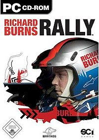

- 

  Image via [Wikipedia](http://en.wikipedia.org/wiki/Image:RichardBurnsRallyBox.jpg)

There once was a boy, whom you wouldn't be far from wrong by calling Swizec, who liked racing games. He was once good at such games, completing numerous different rally simulations and need for speed games and all manner of weirdos. There was one, however, that eluded his skillful grasp - [Rally Trophy](http://en.wikipedia.org/wiki/Rally_Trophy "Rally Trophy"). That he never did get the hang of. But soon he stopped gameing altogether and the unfortunate game faded from memory and drowned in a long series of sleepless coding nights. Then, one day, as if out of nowhere, the old love rang at the door. It was the only game he could think of that worked on the dazzling sparkle that was his new Mac. And he played, he played a lot and then some. And he won. Quite much. Except on hard, that was too hard and he only got to 70% before it became too insane. Then one lonely night, with his girlfriend far away and his code old and boring he decided it was time to play some games again. And he searched and he danced a bollywood dance and he found [Richard Burns Rally](http://en.wikipedia.org/wiki/Richard_Burns_Rally "Richard Burns Rally"). A game that surprisingly worked near perfect on wine. Ah but Richard Burns Rally wasn't just any old rally simulation, oh no, this was a **realistic** rally simulation. So realistic in fact, it comes with its own set of driving tutorials. And the boy sucked, the boy sucked so very much he needed to resort to input controls tweaking just to be able to play even passably lousy on his keyboard. The driving wheel, sadly, unfortunately, woefully, did not play very nicely with wine and the boy does fear this game of games can only be played ... with a racing wheel controller. But anyhow, to see the boy suck, please point your eyes at the following shiny pictures of strangely fast motion that the screen recording device sped up for some inexplicable reason.  

[![Reblog this post \[with Zemanta\]](http://img.zemanta.com/reblog_e.png?x-id=4891a14b-f14f-4475-90b0-6eedb8f0c524)](http://reblog.zemanta.com/zemified/4891a14b-f14f-4475-90b0-6eedb8f0c524/ "Reblog this post \[with Zemanta]")