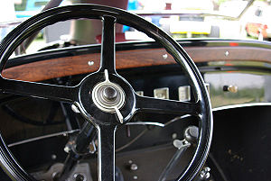

- 

  Image via [Wikipedia](http://en.wikipedia.org/wiki/Image:Napier-Railton_cockpit.jpg)

Yesterday [on slashdot I read an article](http://news.slashdot.org/article.pl?sid=09/05/20/1317218&art_pos=23) about how the [UK](<http://maps.google.com/maps?ll=51.5,-0.116666666667&spn=10.0,10.0&q=51.5,-0.116666666667 (United%20Kingdom)&t=h> "United Kingdom") and Aussieland are going to attempt a program to prevent drivers from [speeding](http://en.wikipedia.org/wiki/Speed_limit "Speed limit"). The idea is to fit cars with a [GPS tracking](http://en.wikipedia.org/wiki/GPS_tracking "GPS tracking") device (big brother much?) that would monitor the vehicle's speed then warn the driver when they're speeding. Ultimately if the driver doesn't stop speeding the device would take power from the car and make it physically impossible to speed. Although I do wonder if it won't automatically also send you a citation for your thought crimes ...

There is a similar crusade against speeding going on in [Slovenia](<http://maps.google.com/maps?ll=46.05,14.5&spn=10.0,10.0&q=46.05,14.5 (Slovenia)&t=h> "Slovenia") at the moment. We have TV commercials, that nobody actually watches, and billboards, that nobody really cares about, and I'm sure some other things as well - all trying to make us think OMGSPEEDINGISSOVERYBADFORMEISHOULDDRIVELIKEANANNY ... must say I like how they're making a visual play on cigarette warnings and saying things like "Speedy drivers die younger"

However, I don't udnerstand why. Speed doesn't kill. Speed doesn't cause accidents. If anything, speeding makes it more likely for you to take part in a [car wreck](http://en.wikipedia.org/wiki/Car_accident "Car accident"). The only thing speed does do is make crashes a bit more devastating once all the other factors cause them.

Now I won't claim to have any sort of statistical data on what I'm about to say (because it's all rigged to show speed and alcohol are the only ways you can die on the road). All I can offer is anecdotal evidence and some basic common sense salt that makes it sound very plausible ... at least in my head.

**Most wrecks are caused by inattentiveness and bad driving.**

The rationale is that manufacturers are trying their best to make our rides more comfortable and less like driving a car. This is bad. When you can't hear the engine, you can't feel the road and the wheel turns softwer than the average house door, it becomes very easy to forget you're driving. The driver stops paying attention or becomes complacent, they think of other things and so on. Then they crash. Official verdict? Ill adjusted speed ie. speeding.

- 

  Image via [Wikipedia](http://commons.wikipedia.org/wiki/Image:Graham-Paige_613_Interior.jpg)

Cars shouldn't feel like your living room, the steering wheel should properly translate the road into your hands, you should feel the road in your bum and you should hear the engine. In fact I'd go so far as to make a legal limit as to how quite the engine can be inside the car and how stiff the wheel et cetera. If the driver becomes unattentive, hell, stiffen everything up! Snap them back into reality!

However accidents do happen, no matter how attentive the driver is, unexpected things can always happen on road. Hell, the road can suddenly become slick at some point and then you're in trouble.

But the problem is, people simply arent' trained to react properly. So they crash. Official verdict, once more, would be speeding. Although inability to manuever the car properly would be a much better verdict. It is my personal oppinion that driving school shouldn't be just teaching us how to drive in traffic and not to speed, by god how annoying they were with the not speeding - I failed thrice because of it. What they should be teaching is how to brake effectively (I think 70% of the people don't know just how short of a stopping distance their car can have), how to steer effectively, what to do when the car understeers/oversteers and most of all, just what on earth the car is capable of because most cars out there stick to the road much better than people give them credit for.

- 

  Image via [Wikipedia](http://en.wikipedia.org/wiki/Image:Malibucrash.JPG)

If I could have it my way all drivers would be required to take a driving skill test every five years. We should also be adopting [Finland](<http://maps.google.com/maps?ll=60.1666666667,24.9333333333&spn=10.0,10.0&q=60.1666666667,24.9333333333 (Finland)&t=h> "Finland")'s (or is it the whole of