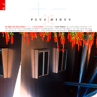

**10:16** Today was horrible walking weather. Groggily stumbling to IJS felt a bit like trying to swim through a sauna. I don't even know how late I was getting here, but I somehow managed to snatch the very last [energy drink](http://en.wikipedia.org/wiki/Energy_drink "Energy drink"). Yay! Shame I'm in last row this time ... think we're listening to @markostamcar talking about ... something. Is this the "[code snippets](http://en.wikipedia.org/wiki/Snippet_%28programming%29 "Snippet (programming)") that saved my life" talk?

- 

  Image via [Wikipedia](http://commons.wikipedia.org/wiki/Image:Smoke_sauna.JPG)

Oh and before anyone asks again, yes, I'm the guy in a black bowler and no that card is not an Ace. Never an Ace.

**10:29** @markostamcar just admited to being a dirty dirty pirate thief. Wonder if anyone from the MAFIAA is here or we're all just a bunch of dirty swashbucklers? Interesting code bit, think it calculates a foreign TV guide into local time for torrent browsing.

**10:34** Interesting thing I just noticed. Trying to make fancy &lt;?phpconference in a blog title makes wordpress do funny things like simply cutting everything ahead of &lt;? off. Couldn't you please just escape it? It felt lovely having it there and now my url is all funky.

**10:51** Miha Hribat made a refreshing [commercial break](http://en.wikipedia.org/wiki/Commercial_break "Commercial break") for [igrajmo.se](http://www.igrajmo.se "Igrajmo.se"), whatever that is. Looks interesting, but the talk will be about caching dynamic content. Hopefully we'll all learn something new even though most of us have probably dealt with this before.

**10:58** MogileFS is an opensource filesystem written in perl that runs on the application level and, apparently, uses everything from the DB, disk system and some other funky stuff to keep data safe and bloody quick to access. Sounds very nice. And now the more interesting part about memory caching - the really \\important thing when it comes to cache. Oh hey, I just noticed a corporate-approved dry joke. Well done!

**11:03** Yes [memcached](http://www.danga.com/memcached/ "Memcached")! The greatest thing since caching was invented and of course, all the big names are using it. Been a while since I played around with this thing, should probably try it again. Miha says the biggest object you can store is 1MB in size and since [Twitter](http://twitter.com "Twitter") complained about having a problem with one of their \\important objects exceeding 1MB I'm concluding twitter uses memcached as well ... oh hey I didn't know memcached will only keep things for at most 30 days.

**11:35** Anze Znidarsic will be talking about abusing flash+php to make rich internet applications. And he just received a raging applause for giving us a 15 minute break :D Win.

**11:54** Anze is talking about Flash on the internets, what we can and what we cannot do. Personally I hope flash dies a quick death and we shouldn't be abusing it to do new things like we did with pdf. Sure it's difficult to make things work the same in every browser, but we don't HAVE TO. What we need to do is teach users that things won't look the same everywhere, even native desktop applications don't look the same on everyone's computer.

**12:01**According to what is being said I'm really going to need to look into this Flex Builder thing. It's quite ama

- 

  Image via [Wikipedia](http://en.wikipedia.org/wiki/Image:AsSeenOnTelevision.jpg)

zing how, apparently, you can just design something in Photoshop, export and then just add some working logic and you're done. Looks incredibly simple and like a very fast workflow. Lovely bit is how I can abuse this lecture to pretty much deal away with half the things I could have said on my talk in a few hours. Brilliant! Thanks Anze.

[**12:11**](http://commons.wikipedia.org/wiki/Image:CeBIT_2006_Philips_3D_Display_42_3D6W01_WOW_Richardson_Electronics_KUKFilm_1298_by_HDTVTotalDOTcom.jpg) That is a wonderfully brilliant sample app. Basically a project managment tool for girls. Stores girl_id and her status that is one of "Done", "to-do" or "in progress". Today is definitely much better than yesterday was.

**14:06** We're back from lunch and Mr. Somebody, didn't catch his name, is talking about Comet, which is apparently a method for pushing data from server to client and doing it live. This is something I've always wondered about so I'm about to have my wet dream answered.

**14:12** Comet is interesting. Apparently it's some sort of reverse Ajax and once more isn't a technology in and of itself (just like Ajax) but an architecture design. HTTP/1.1 allows us to do this crap and even though all of this is starting to make a little sense it's quite odd. It's polling, but not polling, or is it polling? Damn, can't wait for the practical demo. (Oh the guy is Mitja Kramberger, cool guy)

**14:20** There almost seems to be more problems with Comet than it provides solutions. Interesting. Since I'm not actually

- 

  Image of [Robert Basic](http://twitter.com/robertbasic)

understanding a whole lot of this (thanks @[robertbasic](http://robertbasic.com "Robert Basic") for giving that wikipedia link) there isn't much summation I can do for you blog readers. Sorry. Or maybe I'm just not paying enough attention since nervousity is building up 'cause I'm up next. Whose stupid idea was it anyway to get over public talking anxiety by talking publicly a lot? Idiot.

**14:31** Comet on the server is where it gets really interesting. Traditional server software is #fail because you need man concurrent connections and they're made to quickly close everything and get on with their lives. Someone should implement an event-based IO, but nobody's really done anything yet, working on it, just not done. So when somebody DOES make something, will the web be all buzzy and broken and fubar and odd as it was when Ajax first became popular?

**14:35** I was wrong. There are many implementations ... makes me wonder why not everyone is doing this just yet like they did with Ajax? Poor gecko browser support? Developer ignorance? What?

**16:00** Wow, I've never had so much fun talking in front of a large crowd for 45 minutes before. Not sure what it was, but I simply blabbed my mouth off. There were even questions when I finished! Yay. Anyhow, seems we'll be listening to Toma