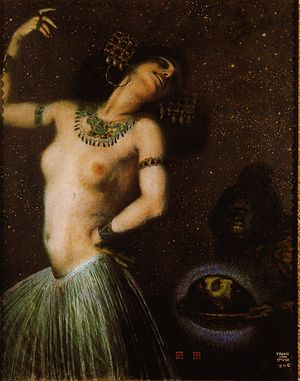

-   

    Image via [Wikipedia](http://commons.wikipedia.org/wiki/Image:Franz_von_Stuck_010.jpg)

Be advised, I am currently fighting a deathly battle with a nasty cold so the rest of this entry might feel a bit foggy and poorly phrased. You were warned. [Burlesque](http://en.wikipedia.org/wiki/Burlesque "Burlesque"), for those who don't know, is a type of [performance art](http://en.wikipedia.org/wiki/Performance_art "Performance art") much like striptease and other "exotic" dances, but on a far more refined level. Now I can't say this for certain having only seen the regular sleazy striptease in person, but burlesque seems to be a far more enjoyable viewing experience than pretty much anything one could imagine. What I love about burlesque is that a lot of it doesn't even necessarily involve nudity, much of it is just damsels hopping about on stage in fancy dress with a supporting cast of burly men in drag. And there's a lot of music, good music. Striptease on the other hand is a bit of a meh, sure the broad gets naked, but it's all so distasteful, so sleazy and rotten it's nigh on unenjoyable ... Therefore I propose that we need to have more burlesque shows in [Slovenia](<http://maps.google.com/maps?ll=46.05,14.5&spn=10.0,10.0&q=46.05,14.5 (Slovenia)&t=h> "Slovenia"), especially because traveling to the US or [London](http://en.wikipedia.org/wiki/London "London") or whatnot just for a show of such nature can hardly be justified. I'm told that there have already been certain occasions of burlesque shows, but I'd be very glad if someone could point me to more such things ... especially, you know, like _before_ the event? Can do? Please do. The closest I'd ever seen to burlesque was [Cabaret in MGL](http://swizec.com/blog/ljubljana-kabaret-vs-london-cabaret/swizec/28) and [in London](http://swizec.com/blog/london-5/swizec/151), but it's just not quite what I'm looking for despite being a supremely awesome show. Now just for a quick taste, here's some Miss Meow Meow, whom I've just discovered today and instantly fell in love with almost as much as with [Amanda Palmer](http://amandapalmer.net "Amanda Palmer").   And since no post about burlesque can be complete without mentioning Dita von Teese. There. Dita von Teese. Hope you're happy now.

###### Related articles by Zemanta

-   [Burlesque: art, or stripping?](http://r.zemanta.com/?u=http%3A//www.guardian.co.uk/lifeandstyle/2009/may/01/burlesque-performance-art-stripping&a=4605248&rid=1d21ac4c-34dc-4081-a1b7-0e5785b7fbf1&e=48eec7c03859353ea02fb6b076c0fca2) (guardian.co.uk)
-   [Burlesque laid bare](http://r.zemanta.com/?u=http%3A//www.guardian.co.uk/lifeandstyle/2009/may/15/burlesque-feminism-proud-galleries&a=4928200&rid=1d21ac4c-34dc-4081-a1b7-0e5785b7fbf1&e=cb31739ead0d4c890f497e95591106f2) (guardian.co.uk)
-   [Enjoying burlesque is part of female sexuality, not a betrayal of it](http://r.zemanta.com/?u=http%3A//www.guardian.co.uk/commentisfree/2009/jun/04/burlesque-dance&a=5391526&rid=1d21ac4c-34dc-4081-a1b7-0e5785b7fbf1&e=78d5e063d6d051a628c55c6922439824) (guardian.co.uk)
-   [Dita Von Teese is Triple Door Decadent](http://justjared.buzznet.com/2009/04/02/dita-von-teese-triple-door/) (justjared.buzznet.com)

[![Reblog this post \[with Zemanta\]](http://img.zemanta.com/reblog_e.png?x-id=1d21ac4c-34dc-4081-a1b7-0e5785b7fbf1)](http://reblog.zemanta.com/zemified/1d21ac4c-34dc-4081-a1b7-0e5785b7fbf1/ "Reblog this post \[with Zemanta]")
