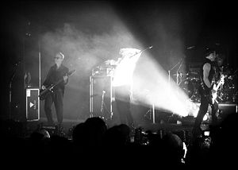

- 

  Image via [Wikipedia](http://commons.wikipedia.org/wiki/Image:Bauhaus_concert.jpg)

When I was about thirteen years of age I discovered music - you know, real music, outside of what you see on television, hear on the radio and pick up from your parents. It was at that age that I discovered metal was pretty cool, transitioned my clothing to black and essentially discovered that music comes in albums that can be either bought for extortionate moneys or downloaded for free (audiogalaxy.com was The Thing back then)

A bit later in life I realised metal was actually rather dull and became more and more [goth](http://en.wikipedia.org/wiki/Goth_subculture "Goth subculture"). It could be argued that metal was the gateway music for me, was just different enough not to be [pop](http://en.wikipedia.org/wiki/Pop_music "Pop music"), but not exactly high quality (sorry to all [metalheads](http://en.wikipedia.org/wiki/Metalhead "Metalhead"), but most of it is just extremely dull). As I became goth I was trapped because once you're goth, you can't actually stop being goth. It's a very virulent subculture in that sense.

At first you're a noob goth who wears too many spikes and tends to be different, just like everyone else. Then as a goth grows older they realise all the spikes and makeup are somewhat silly. Even later they realise leather boots and similar don't quite work out in the summer. Perhaps at some point they might even discover that colours other than black can be worn - revelation! HOWEVER! None of this will prevent a person from being goth. Even outwardly proclaiming yourself not to be goth ... will make you even more goth. I don't pretend to actually understand how or why this works, but simply put - the less goth you think of yourself, the more goth you are.

This brings us back to the MAFIAA topic. Notice how at thirteen I discovered music and albums? This was because back then the MAFIAA already invented The Single, but it was promotional material, it basically said _"Look, we made a cool song, we have others"_ the video served the same purpose. These days my sister is fourteen. She has yet to discover music. The only music she ever listens to is music television (not just [MTV](http://en.wikipedia.org/wiki/MTV "MTV")) and whatever her friends bluetooth to her phone. Of course her friends, also, haven't really discovered music and so only singles get passed around.

- 

  Image via [Wikipedia](http://en.wikipedia.org/wiki/Image:WKAP_Amazon_cover.jpg)

This is in large part a fuck up by the MAFIAA. At some point they became so obsessed with promotion that nearly half the songs on an album are released as singles. Everything can be bought and downloaded as a single music file - which may or may not magically stop working.

No wonder people aren't buying albums anymore you stupid gits, it's because you never talk about albums anymore! You just keep promoting _songs_.

I don't know, maybe I'm just growing out of touch with the common teenager, but I used to cherish the idea of a [music album](http://en.wikipedia.org/wiki/Album "Album"). I _wanted_ to see an artist's full breadth, not just a song here and there. Of course half the album usually sucked, but that's alright, it gave us insight, it helped us **feel** the music and the artist's soul.

Today ... today music feels more like a glorified [special effects](http://en.wikipedia.org/wiki/Special_effect "Special effect") fuckfest. And it's all the MAFIAA's fault. It's people like them that forced Amanda Palmer to abandon her music record so as to be able to actually create music. Surprising fact - she's even more successful after having abandoned them and sells more of