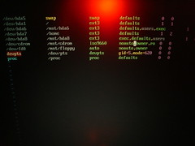

-   

    Image via [Wikipedia](http://commons.wikipedia.org/wiki/Image:Kubuntu_8.04_login_screen.png)

Throughout the few years I've been using [Kubuntu](http://en.wikipedia.org/wiki/Kubuntu "Kubuntu"), especially since the switch to KDE4, I've grown accustomed to funny looks people gave me. _You're using Kubuntu ... seriously!?_ But never, not once, could anyone give a suggestion that would be better than the bug-ridden kubuntu we all know and sort of love. Until a few weeks ago when someone asked why I don't simply try out [openSUSE](http://en.wikipedia.org/wiki/OpenSUSE "OpenSUSE"), that it's supposedly the best [KDE](http://en.wikipedia.org/wiki/KDE "KDE") distribution outside things like [Gentoo](http://en.wikipedia.org/wiki/Gentoo_Linux "Gentoo Linux") and the likes with proper KDE. And yesterday I did, I downloaded openSUSE and installed it. The installation process seemed to go smoothly enough, a checkbox here, an input field there, a complaint about fstab here and there, a few suggested fixes and away we go. Reboot. But after the reboot I was in for an unfriendly surprise - it couldn't properly read the fstab it had created. Err what? Then it couldn't mount some partitions and wanted me to fix things ... errr sure, fine, at least I know what a fstab is and aren't just some poor home-user. Mmkay, so the fixing tool couldn't quite read the [partition table](http://en.wikipedia.org/wiki/Disk_partitioning "Disk partitioning") either and wanted to make some stuff up. No fucking way mister, I need my datas. But it still somehow managed to kill 300 gigs of movies and tv shows :( That sucked a whole lot. And still it didn't work.

-   

    Image by [markuz](http://www.flickr.com/photos/12345574@N00/38761786) via Flickr

Alright, we'll do a reinstall. Err, hi dear computer user, I can't read this fstab I've made, help me out please. Sure, I'll help you out you fucking moron of openSUSE. How come you can magically read it when I say "use the old table"? Then it didn't install, guess why, oh that's right, the fixing tool made one of the partitions with -5.00MB of free space. Wtf!? So the installer complained, wait for it, there isn't enough disk space to install openSUSE. HA! Fine, we won't mount that partition, magically it almost worked. I ended up having to forcfully not mount all of my data partitions so that it could finally mount everything it wanted and just do a fucking install. So I finally get into KDE and it's all fugly and crap. But alright, that's to be expected, needs drivers after all. What's this? No internets? Fine. After spending half an hour doing what should only take a couple of minutes I could finally get online, I still don't know which setting exactly managed to finally do it. And hey, even routing (I use the computer for a router too) magically worked. Lovely. Finally I managed to install the nvidia drivers (no, not from the [software installation](http://en.wikipedia.org/wiki/Installation_%28computer_programs%29 "Installation (computer programs)") tool like I would in [Ubuntu](http://en.wikipedia.org/wiki/Ubuntu "Ubuntu"), I had to find them on my own, windows much?). It then took me a good twenty minutes to find the right screen resolution, if I'm not mistaken Ubuntu manages this on its own. Then I couldn't get dual monitors to work through the settings tool and had to use nvidia's proprietary thingy. Sure, I have to use nvidia-settings in Ubuntu as well, but for fuck's sake, don't present me with a configuration option that doesn't work! Now I wanted lovely [Compiz Fusion](http://en.wikipedia.org/wiki/Compiz_Fusion "Compiz Fusion") effects, because I simply feel that having a beefy graphics card and a [Linux](http://en.wikipedia.org/wiki/Linux "Linux") should mean a sexy user experience (unlike Windows who can't provide one). Alright, we just go to the software managment tool and install compiz. Accidentally I clicked a package I wanted (think it was compiz-plugins-extra) and I get an ugly popup box crying out loud that this cannot be done, that there are dependencies that cannot be fulfilled ... three rows down I clicked compiz-plugins-main and lo and behold, dependancy resolved. The correct order of clicking checkboxes isn't something I should be troubled with in 2009. After installing compiz there was no way to configure it because the config thingy is in a different package and I'd forgotten about that. So I go install that but what's this. CAN'T, because I need a newer compiz (yes, it was an ugly we can't solve this dependancy popup), ok fine for fuck's sake, just install the newer compiz. I don't fucking give a fuck about this, it's 2009 for fuck's sake! But, you've guessed it, I was presented with a fucking huge popup box with hundreds of checkboxes that, I believe, would drive me into dependancy hell while updating the whole openSUSE from stable to Factory. At this point I decided to fuck openSUSE and go back to Kubuntu. Tonight I find out if it can at least burn an iso properly, since it apparently can't do much of anything else that I've come to take for granted.

[![Reblog this post \[with Zemanta\]](http://img.zemanta.com/reblog_e.png?x-id=c53c0870-b604-4ac7-b470-24e8abd5161a)](http://reblog.zemanta.com/zemified/c53c0870-b604-4ac7-b470-24e8abd5161a/ "Reblog this post \[with Zemanta]")
