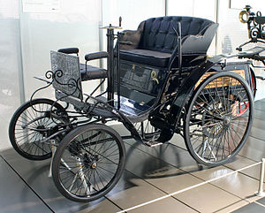

- 

  Image via [Wikipedia](http://commons.wikipedia.org/wiki/Image:Benz-velo.jpg)

As is often the case, I saw a news item that "shook the nation" only about three days post facto and as is also \[too] often the case, it was about a horrendous [vehicular collision](http://en.wikipedia.org/wiki/Car_accident "Car accident") that nipped a few young lives in the bud.

What exactly happened isn't all that \\important - a [drunk driver](http://en.wikipedia.org/wiki/Drunk_driving_%28United_States%29 "Drunk driving (United States)") was driving against traffic on a highway and eventually caused a crash. People are dead, cars are mutilated, the press had a new bone to chew for a few days. Nothing new here.

There _is_ however something that is in fact very new. Someone suggested that drunk people who cause crashes with deadly consequences should be charged with [manslaughter](http://en.wikipedia.org/wiki/Manslaughter "Manslaughter"), even going so far as calling it a deliberate murder.

An interesting proposition, but there are two things about the whole argument that are disgustingly against any and all logic a human being can muster:

**1.**The least, but perhaps the most, obvious heart-clenching what the fuck moment when I heard this argument was _Wait WHAT!? When you kill somebody with a two tonne killing machine you aren't charged with manslaughter? Not even manslaughter out of negligence?_

Naturally I'm no lawyer, but I think