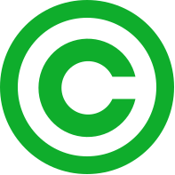

-   

    Image via [Wikipedia](http://commons.wikipedia.org/wiki/Image:Green_copyright.svg)

Yesterday somebody shared a cool podcast with me. Well I should say they tried to, thing is, I didn't have an iStore account. But whatever, I'll just make one right? Well ... no. That particular podcast is only available in the US due to copyright restrictions or something, or maybe it's just that most of the store is US only, but whatever. Thing is, I had to make an account and I had to make an American one. Not a Slovene one. No biggie right, go to the iStore, make an account. Well no, you can't choose where you're from. So let's change the language/locale to US and voila, american store. HEY even paypal is available now (yes we've got PayPal in Slovenia but Apple is an idiot and doesn't aknowledge this fact). Yay, choose paypal, make account. Nope, says I'm not from the US. Fine, I'll give you my credit card info ... well fuck you mister Swizec, credit card says you're not american. Fail. This is the process I had to go through to have a valid US Apple ID and iStore account.

1.  Find a free App.
2.  Download App.
3.  Create account
4.  Choose without CreditCard (they can't demand payment info for free downloads, some legal stuff afaik)
5.  Enter some US address found on google maps (I used [M5 Industries](http://en.wikipedia.org/wiki/M5_Industries "M5 Industries") because [Mythbusters](http://en.wikipedia.org/wiki/MythBusters "MythBusters") is made there and I love Mythbusters). Btw this isn't identity theft because you use your own name.
6.  Rejoice, you have a valid US iStore account

Great! I can now download **FREE** stuff that is, for some strange and utterly absurd reason, only available in the US. Why have region restricted copyright when the content is bloody free is ... can anyone explain this at all?

[![Reblog this post \[with Zemanta\]](http://img.zemanta.com/reblog_e.png?x-id=b7015c77-1a4f-4945-97ad-10b5f0edea2f)](http://reblog.zemanta.com/zemified/b7015c77-1a4f-4945-97ad-10b5f0edea2f/ "Reblog this post \[with Zemanta]")
