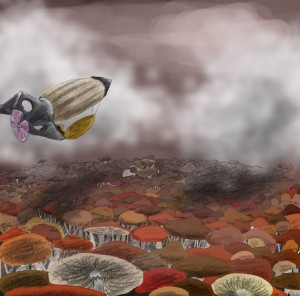
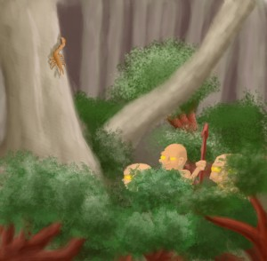
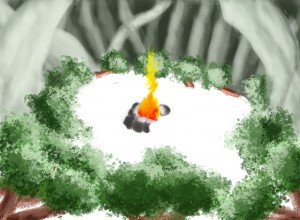

Cthulhu and other crazies was a webcomic I drew between April 2006 and May 2007. The format, content and spirit of this comic were heavily influenced by Kazu Kibuishi's Copper. This webcomic was the only one I ever really prepared for and I've still got tens of pages of sketch studies for each character and as my girlfriend's wall can attest I could still draw the characters passably well years after having stopped using them anywhere. The whole corpus of content for this webcomic remains, it is perhaps a mark that some day when I'm not so busy programming anymore I might get back into drawing. The whole blog still holds the title in homage to this work after all :P \[book id='3' /] And I've managed to find the first ever concept art for this comic.

And believe it or not, some tiles from an unreleased page :D

