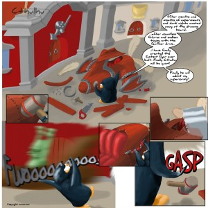

 For several months I have been meaning to get my lazy bum off the proverbial chair and make a projects page listing every interesting-ish thing I've ever worked on. Most say this helps in finding employers and blahblahblah. For me having such a page is all about knowing what I've worked on because I've noticed there is just so much stuff I can't for the life of me remember everything when I want to and just end up listing random things off the top of my head. This is obviously bad. Another reason why I wanted to create such a page was to have a place to store the art I occasionally do because a lot of it has simply vanished into history ... not in the least bit due to my destructive nature of often destroying things I deem unworthy of being remembered. All of the poetry I've ever written has thus vanished into oblivion one day, all 90 pages of it. If you turn your attention towards the [**portfolio**](http://swizec.com/blog/projects-portfolio), you will notice that there are some things really unworthy of mention in there, specifically true of the first two webcomics and Urbanislovar, but I felt they are ultimately an important piece of who I am and are thus included for completenes' sake. Anywho, it was fun creating this thing even if it did take four hours last night. The sheer amount of stuff I've done dumbfounds me ... where'd my life go? Where is all the partying? The crack and hos? I'm gonna have an incredibly fun midlife crysis in a few decades won't I? Oh and by the way, [Cthulhu and other crazies](http://swizec.com/blog/projects-portfolio), the webcomic that gave its name to this blog and was the sole reason swizec.com even exists today has been fully backed up to the portfolio :) I actually think this one was almost good, the writing was a bit stiff and the drawing a bit lame, but I like it anyway ... might eventually continue. PS: the best thing about that Cthulhu webcomic is the technology style I invented, this was before I'd ever heard of steampunk and notice how it adopts the same kind of features? Futuristic history, love it. Seriously, have a look at those 8 pages or so of comic, you'll breeze through it. Unlike myself who spent around 60 to 80 hours making each page ...
