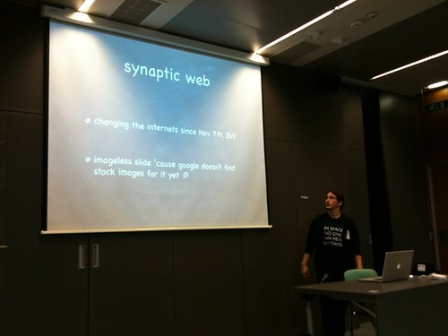

 It was it truly was! Happy fun times all around. Until about like six in the afternoon or whatever the time was when everybody looked like a knackered zombie held together solely by the caffeine molecules in the blood stream. The last presenter I was paying any amount of serious attention to - Igor Kolar - even opened his talk with something to the extent of _Excuse me when everything goes wrong, but I'm knackered as hell._ But it was fun, although the insolent bastard who provided only herbal tea should be shot, quartered and hung as a pinnata and beaten with sticks by small children until tea started falling out ... meh we the tea drinkers forgive him, there was still taurin available. I put forth a presentation of the [Synaptic Web](http://synapticweb.org/), how we're getting there and what it means blahblahblah. Unlike last time I even uttered actual words this time! Victory for all involved! Well ... not completely, there was the small issue of my having been versed in doing pitches lately, which resulted in the talk being bloody too short by a country mile. Somehow we fixed that by me blabbing on for a few moments about what Preona is up to and then the whole presentation sort of devolved into a conversation of sorts and we stumbled around the interwebs for a while looking for interesting things and we even watched a video! Yay. Now that I think of it, I could've just rolled the video of Khris Loux talking about these things that can be found on [synapticweb.org](http://synapticweb.org/), some other time perhaps. Meh it wasn't all that bad, we ended up being thrown out and even if the public was less than amused, standing there in front of them and making a fool of myself was damn fun. What else ... (the phrased used often during my presentation) ... oh right! We can talk for a bit about the wonderful food that was served. It was wonderful! Omnom! And uhm ... well I guess 90% of the people reading this were at webcamp ljubljana anyway so I'll just shut up now, here's the slides for my presentation.

[Synapticweb Webcamp 2k9](http://www.slideshare.net/Swizec/synapticweb-webcamp-2k9 "Synapticweb Webcamp 2k9")

View more [presentations](http://www.slideshare.net/) from [Swizec](http://www.slideshare.net/Swizec).

PS: the second slide contains a video that slideshare doesn't seem to handle too well
