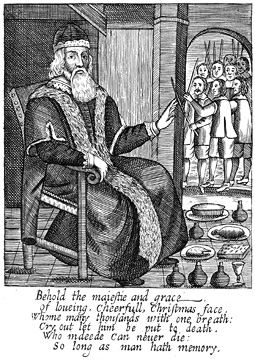

- 

  Image via [Wikipedia](http://commons.wikipedia.org/wiki/Image:FatherChristmastrial.jpg)

Today is supposedly [human rights](http://en.wikipedia.org/wiki/Human_rights "Human rights") day, a celebration so empty and void of any consequental meaning as Christmas, Birthdays and any other arbitrary date and/or event people decide to celebrate. Besides, every day is a day of something and it's getting kinda old, what when new 'days' need adding? We're going to do special days on a fiscal year that lasts 1.6732 years instead of 1.0 years like it does now? Nigga please. There you go [@anca_foster](http://twitter.com/anca_foster), I ranted absolutely carelessly about human rights day. You can thank me later. This post brought to you from the special department of sleepiness, tardiness and general mehness about the current big \\important thing(tm).

[![Reblog this post \[with Zemanta\]](http://img.zemanta.com/reblog_e.png?x-id=b1459153-a9fe-4a6e-afb9-3509c9d0d147)](http://reblog.zemanta.com/zemified/b1459153-a9fe-4a6e-afb9-3509c9d0d147/ "Reblog this post \[with Zemanta]")