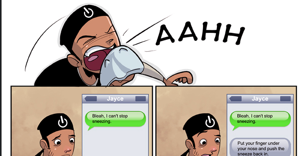
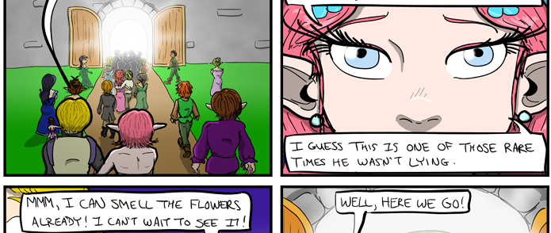
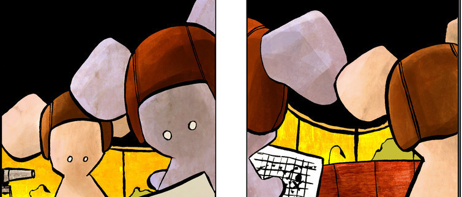
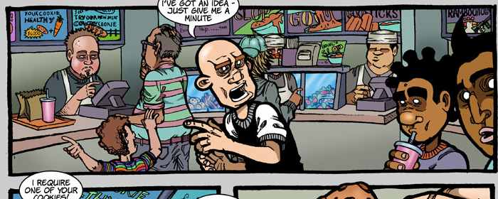
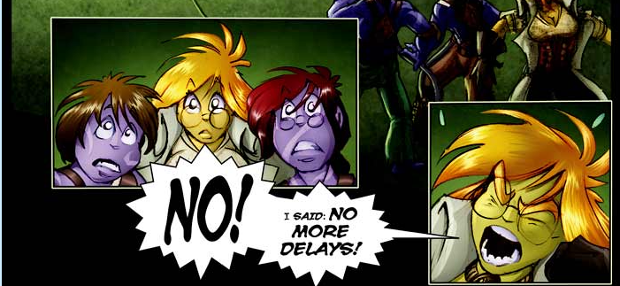
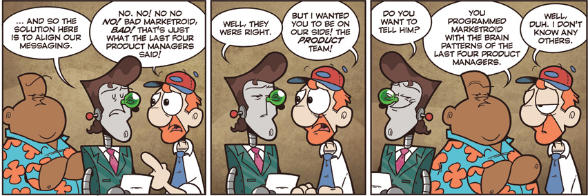
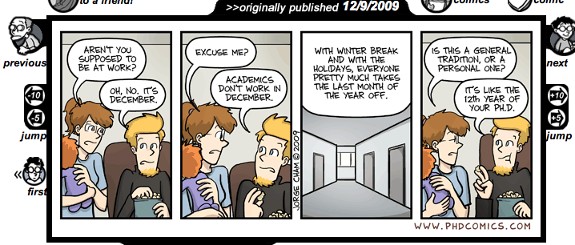
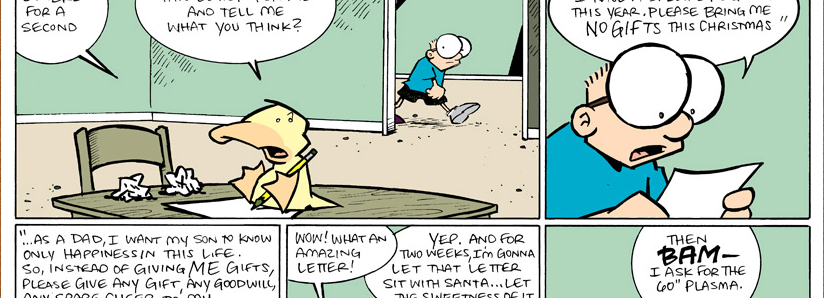
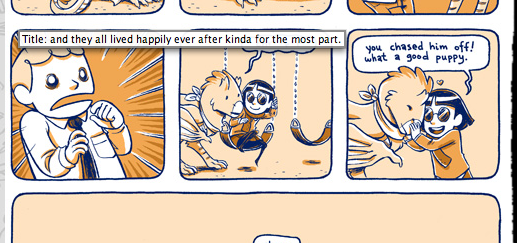
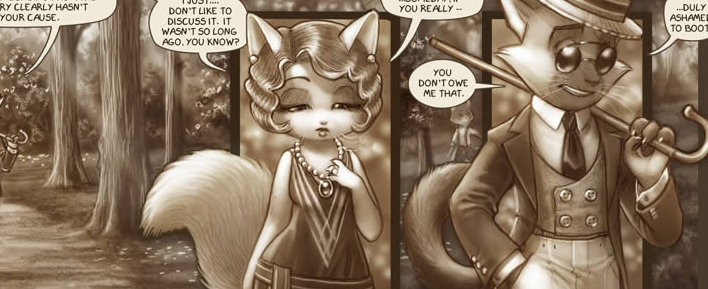

Webcomics have been an internet constant for a while now and while I've become a fan almost in their infancy back when Elftor and PA were king (I never read PA) ... oh must've been something like \*gulp\* eight years ago ... fuck I'm old. Anyhow, my second big love was CAD, which I've been reading to this day. Sometime during the whole affair I was quite popular on their forum, then a certain revolt happened, which I magically survived and then I got banned a few months later ... oh well. But I loved that forum, learned a lot about painting there. It would seem that there are even more comics that I used to read, but don't read anymore, than there are comics I _do_ read. There are such marvels as Pewfell, the Dreamwalker Chronicles and Lackadaisy - in all the bookmarks folder for webcomics holds **58** different links. Out of those I only read twelve today, with a few new ones still in the buffer for me to go through the archives. So in no particular order:

### Ctrl-Alt-Del

### AppleGeeks

### Bardsworth

### Bunny

### Commissioned

### Girl Genius

### Not Invented Here

### PHD Comics

### Sheldon Comic

### Wulffmorgenthaler

### Johnny Wander

### Lackadaisy

Two honourable mentions also go to [Copper](http://www.boltcity.com/), which should really start updating again, and [Ugly Hill](http://uglyhill.com/), which ended, but @paulsouthworth awesomely went on to do Not Invented Here. Sadly, most of the comics I stopped reading lost my attention due to my simply forgetting to click the bookmark for a while. Henceforth this is remedied because I have resolved to continue reading only through RSS. Life is too hectic even **if**the only really proper way to enjoy a webcomic is by going to the home page. PS: of course there is also XKCD, but I refuse to even bookmark that one. There's a special charm in entering the URL by hand every Monday, Wednesday and Friday.

[![Reblog this post \[with Zemanta\]](http://img.zemanta.com/reblog_e.png?x-id=29634916-1c04-4f1d-a800-88d226ebefed)](http://reblog.zemanta.com/zemified/29634916-1c04-4f1d-a800-88d226ebefed/ "Reblog this post \[with Zemanta]")
