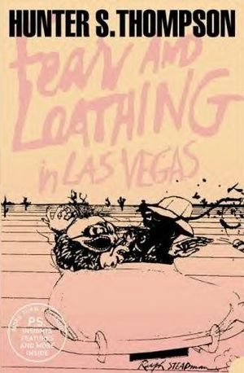

- 

  Image via [Wikipedia](http://en.wikipedia.org/wiki/Image:Fear_and_Loathing_in_Las_Vegas.jpg)

Last night I was discussing [goth music](http://en.wikipedia.org/wiki/Gothic_rock "Gothic rock") with a mate and somehow the debate turned into my showing him around what goth music was in the first place. Blahblahblah.

This eventually led to my showing him Velvet Acid Christ, which I still don't know whether they're goth or industrial. And then I showed him a certain song. It triggered memories, many memories.

Particularly the whole story of how I discovered [Fear and Loathing in Las Vegas](http://en.wikipedia.org/wiki/Fear_and_Loathing_in_Las_Vegas "Fear and Loathing in Las Vegas") and [Hunter Thompson](http://en.wikipedia.org/wiki/Hunter_S._Thompson "Hunter S. Thompson") in general - two of the biggest influences on my life and my art and pretty much everything I've ever done since reading the book, watching the movie and becoming a raging fan.

It all started out when I was a wee lad of 15-ish and listening to an internet radio - its name eludes my memory - that played a certain song a whole lot. It contained clips like _Oh god, did you eat all this acid? That's right, you see!_ and uhm ... _This is not a good town for psychadelic drugs, extremely menacing vibrations were all around us._

Back then I was quite a regular and chatted a lot with the DJ's, yes it was a fucking awesome radio, and eventually this meant I asked what the song was and whether it was any particular mix they themselves created.

This is how I discovered Velvet Acid Christ.

So I listened to their music some more and god knows when, I finally decided to look up these sound clips and figure out where they were from.

This is how I discovered Fear and Loathing in Las Vegas the movie.

Watching the movie had an instant effect of making a raging drug lover out of me. Unfortunately, I haven't managed to get my greedy little paws on most of the stuff I've wanted to try ... have been hunting passively for acid for gawd knows how many years now ... but I did try ether that I've made myself. The effects truly are just like the movie describes, it's bloody fun too!

Anyhow, eventually I decided to read Fear and Loathing in Las Vegas the book.

Fucking brilliant stuff! My writing style has never been the same again and it only cemented my dire desire to get into psychadelic drugs as soon as I possibly can ... I still haven't. For shame.

The fucking suck part of wanting to do psychadelic drugs is that we're not in the 60's anymore and everybody just wants to get stoned and drunk and dance for a little longer than usual. Bleh. I want to have _fun!_But this is really another story, which says more about my lack of connections to the drug world than anything else.

[![Reblog this post \[with Zemanta\]](http://img.zemanta.com/reblog_e.png?x-id=e3980dd6-72e8-4553-a085-5ee0f56a6451)](http://reblog.zemanta.com/zemified/e3980dd6-72e8-4553-a085-5ee0f56a6451/ "Reblog this post \[with Zemanta]")