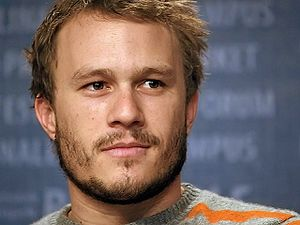

- 

  Image via [Wikipedia](http://commons.wikipedia.org/wiki/Image:Brittanymurphynavy.jpg)

There is something specially tragic about sexy people leaving this world. There was a big humbug when [James Dean](http://en.wikipedia.org/wiki/James_Dean "James Dean") died, there was an outrage [Jim Morrison](http://en.wikipedia.org/wiki/Jim_Morrison "Jim Morrison") died, there was an uproar when Hendrix passed and there was a whole lot of baawwing all over the interwebs when mr. [Heath Ledger](http://en.wikipedia.org/wiki/Heath_Ledger "Heath Ledger") died last year and today we've lost another downright sexy person - [Brittany Murphy](http://en.wikipedia.org/wiki/Brittany_Murphy "Brittany Murphy").

She isn't likely to reach such instant extents of fame and notoriety and legendary proportions of personality as the rest of them did ... probably because she's a woman or perhaps just because she wasn't quite as famous ... but she was nontheless incredibly sexy and gorgeous and by god I wish she did some porn.

I must admit I have no idea why we take such big notice when beautiful people die - perhaps it's just our internal reaction to feeling the sexiness of the world slipping between our fingers. We _want_ the world to be a sexy place and we so rarely contribute anything to the amount of sexy out there that it just strikes us very intimately, very personally, when the sexy is reduced.

They also all seem to go in such dubious circumstances, I'd go in more detail but I couldn't do it much justice because I'm not a [conspiracy theorist](http://en.wikipedia.org/wiki/Conspiracy_theory "Conspiracy theory") at heart ... certainly someone else can do a better job. Why do **you** think they all go so very young and under such strange circumstances?

- 

  Image via [Wikipedia](http://en.wikipedia.org/wiki/Image:Jim_Morrison_-_Fillmore_East.jpg)

- [")](http://commons.wikipedia.org/wiki/Image:James_Dean_in_East_of_Eden_trailer_2.jpg)

  Image via [Wikipedia](http://commons.wikipedia.org/wiki/Image:James_Dean_in_East_of_Eden_trailer_2.jpg)

- 

  Image via [Wikipedia](http://en.wikipedia.org/wiki/Image:Jimmy_Hendrix.JPG)

- 

  Image via [Wikipedia](http://commons.wikipedia.org/wiki/Image:Heath_Ledger.jpg)

[![Reblog this post \[with Zemanta\]](http://img.zemanta.com/reblog_e.png?x-id=2dbcdf9e-9eba-42a8-bc71-11b66b68b73e)](http://reblog.zemanta.com/zemified/2dbcdf9e-9eba-42a8-bc71-11b66b68b73e/ "Reblog this post \[with Zemanta]")