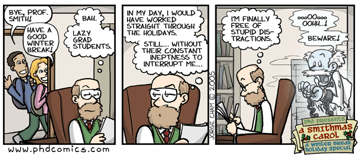
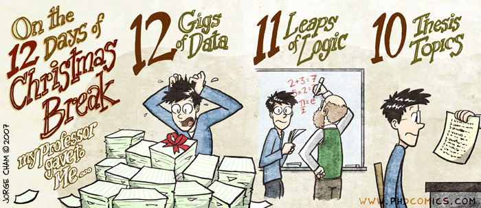
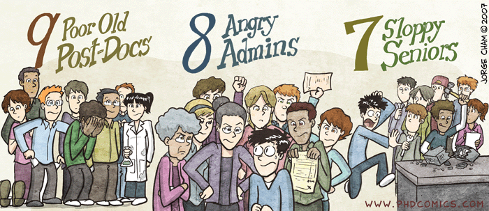
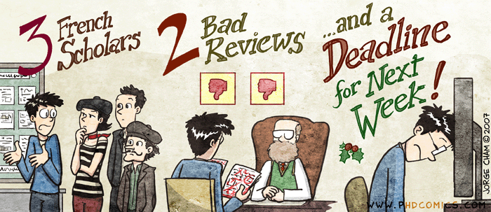

Traditionally new year's and Christmas have held a special place in the heart of students all over the world - it's usually a time when everybody gets a winter break, that proper time when you're not studying for exams, when you're not doing anything special, when you're just enjoying yourself. Lovely. Bullshit! The real reason students love this time of year is that finally there are no classes, no tutorials, no whatevers - it's just free time where you can actually get some work done without everyone getting in your damn way. Of course there are many who disagree with me and actually _do_ take it easy over the holidays, but most of them don't strain themselves very much anyway. For them, and those of us who like to work during holidays, here's a few special comics describing just what the professors think winter break is for.   So what are you doing over the holidays?

[![Reblog this post \[with Zemanta\]](http://img.zemanta.com/reblog_e.png?x-id=716c3e41-e420-46b9-ad53-d4fa30c57736)](http://reblog.zemanta.com/zemified/716c3e41-e420-46b9-ad53-d4fa30c57736/ "Reblog this post \[with Zemanta]")
