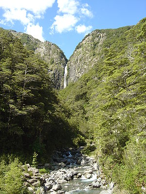

- 

  Image via [Wikipedia](http://commons.wikipedia.org/wiki/Image:Devils_Punchbowl_Waterfall%2C_New_Zealand.jpg)

Perhaps it's not the best of ideas to talk about one's [recreational drug](http://en.wikipedia.org/wiki/Recreational_drug_use "Recreational drug use") experiences publicly, but everyone who reads this blog is a junkie anyway so it doesn't matter. (ie. they're caffeine drinkers! \*gasp\*)

So last night I gave my first ever proper try to [psychoactive substances](http://en.wikipedia.org/wiki/Psychoactive_drug "Psychoactive drug") - namely shrooms - and kicked off my psychonaut carrier with a boom. Since I don't know how much I actually took, I'll just describe some of the experiences that stuck in my mind and perhaps someone can tell me what happened.

Before you get too excited, there were no religious revelations, no openings of the mind and I most certainly didn't start climbing down any rabbit holes. But by god was it fucking amazingly awesome fun!

1. A lot of the experience felt like it wasn't happening in real time, but more like I was remembering it from a distant future - this happens to me almost every time I'm intoxicated though, the shrooms perhaps just intensified the whole experience.
2. **Time stopped.** This might have been just because somebody put a large stopped clock in the middle of the room, but nevertheless it was exactly like we were all stuck in a time bubble and it would be 10:37 for all eternity.
3. **Perceived paralysis** - don't know what exactly caused this, but most of the time I couldn't feel my extremities and felt quite odd from the waist down. This might be my deep phobia of paralysis popping up - but I didn't perceive it as frightening, just as bloody exciting.
4. **Perspective distortion** - this was quite ... odd ... everything was in a strange perspective and just plain wrong. It didn't make sense and as a result I felt very strong vertigo whenever I tried to do anything.
5. **We are world** - perhaps the most emotional sensation from the whole trip. Simply put I felt like I was always in a world of my own, or sometimes "our" own. When I went to get a drink, the faucet pulled me in and the sink felt like the whole world, like there is nothing else. Basically, whenever my visual surroundings changed it felt like the whole world became those surroundings.
6. **Extreme naivety** - this was of course closely followed with extreme naivety. When somebody said that we're in a mountain cabin, I was convinced, downright certain of it, that just on the other side of the door there was at least a meter of snow keeping us inside.
7. **A bit of [paranoia](http://en.wikipedia.org/wiki/Paranoia "Paranoia")** - I'm often a fairly paranoid individual when I get into a bad train of thought, but this was different because it was backed by some pretty solid fears. Like when people made funny and sarcastic remarks of some sort I felt like bashing their head in and shouting _Don't tell me this things! Not now!_
8. But the worst was **perceived incontinence** - of course this ties into paralysis and paranoia, but I swear perceiving my legs' warmth as something external and having wet socks from the leak