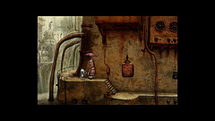
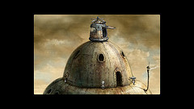
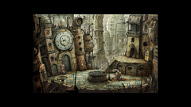
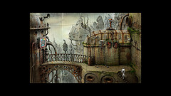
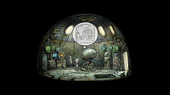
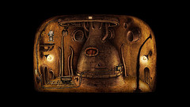

-   

    Image by [deadman009](http://www.flickr.com/photos/50598806@N00/4239467371) via Flickr

-   

    Image by [deadman009](http://www.flickr.com/photos/50598806@N00/4240288076) via Flickr

-   

    Image by [deadman009](http://www.flickr.com/photos/50598806@N00/4240229860) via Flickr

-   

    Image by [deadman009](http://www.flickr.com/photos/50598806@N00/4240224898) via Flickr

-   

    Image by [deadman009](http://www.flickr.com/photos/50598806@N00/4239506225) via Flickr

-   

    Image by [deadman009](http://www.flickr.com/photos/50598806@N00/4239434615) via Flickr

Now and anon I like to fire up a game when I'm feeling a dash unmotivated to do pretty much anything. Most often I simply don't have time to play, so when I do play I want the game to be something fascinatingly epic but in such a way as can be enjoyed ten minutes here, twenty minutes there, an hour over yonder. NOT something you have to play for three hours straight before you get in the groove. Two nights ago I discovered [Machinarium](http://machinarium.com/ "Machinarium") through a hapless link in a msn chat. I was instantly hooked, the art is simply amazing, the level of detail beyond all comparison. The gameplay itself. Oh! Don't get me started, I could \*gasm all over at the mere thought of the brilliance therein. Basically you play a robot that goes through a few adventures and solves many a puzzle in a beautifully designed world to, well I dont' know what yet, haven't gotten that far. It would seem though that it's got something to do with love because whenever his memories are shown they're about a lady robot. It is also one of the hardest [puzzle games](http://en.wikipedia.org/wiki/Puzzle_video_game "Puzzle video game") I've ever had the pleasure of playing. Shivers, [Monkey Island](http://en.wikipedia.org/wiki/Monkey_Island_%28series%29 "Monkey Island (series)"), Abe's Oddysee/Exoddus? Don't get me started, _weaksauce_ in comparison to Machinarium! Downright bloody weaksauce! Often you will encounter a proper logic game, one as can be bought in stores sometimes, you've got to solve just to open a door. Other times you are left solving five puzzles just to get to an item that solves a previous puzzle. The best thing though? It's absolutely [DRM](http://en.wikipedia.org/wiki/Digital_rights_management "Digital rights management") and any and all copy protection free. Buy the game, get the downloads for all OS's and a soundtrack! Yay! How could I resist? So I didn't, I shelved out the few euro it takes and it was possibly one of the best moneys ever spent. Big [game publisher](http://en.wikipedia.org/wiki/Video_game_publisher "Video game publisher"), if you are reading this, yes, yes I do only buy games if they come without DRM. Sometimes I _consider_ buying a big-name game, but usually get disappointed by the process half-way through and bail.

[![Reblog this post \[with Zemanta\]](http://img.zemanta.com/reblog_e.png?x-id=abb3af50-5404-4c7c-8508-df48756a4920)](http://reblog.zemanta.com/zemified/abb3af50-5404-4c7c-8508-df48756a4920/ "Reblog this post \[with Zemanta]")
