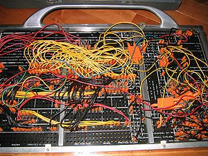

-   

    Image via [Wikipedia](http://commons.wikipedia.org/wiki/Image:IBM402plugboard.Shrigley.wireside.jpg)

This is the first post in the series of _How &lt;x> changed my style_ where I shall talk about tools and events that had a significant impact on my style of doing things. If you happen to like this idea, I would be very happy if you could help it spread like wildfire, because it's a form of [pay-it-forward](http://en.wikipedia.org/wiki/Pay_it_forward "Pay it forward") where we say Thanks for cool stuff. Some months ago, fuck has it been two? three? four?,
