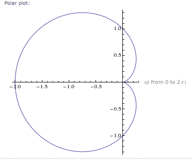
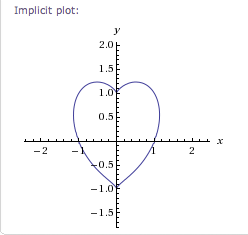
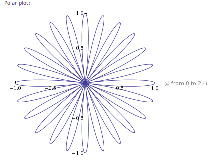
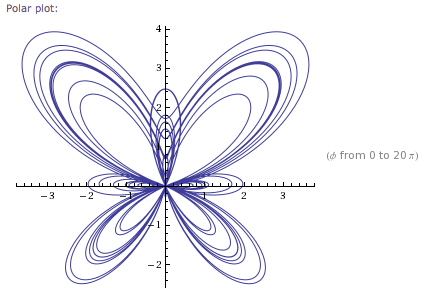

This whole week I've been doing a lot of maths studying. Things like [parametric curves](http://en.wikipedia.org/wiki/Parametric_equation "Parametric equation"), LaGrange theorems and funky functional sequences.

Naturally I've developed a bit of a love for pretty mathematical objects, so I wanted to share some with you.

1\. Our first contestant is the [cardioid](http://en.wikipedia.org/wiki/Cardioid "Cardioid"). She's a bit chubby on the sides but has a heart of gold.

2\. The second contestant is an implicit heart and was contributed by a bloke on Facebook whom I believe has had this saved somewhere because it would be just mindblowing if he even know it from heart, let alone could create it.

3+-+x2+*+y3+%3D+0)

3\. This little nugget followed from my experimentation with parameters of a curve I don't know the name of ... it's a flower if you haven't noticed.

+for+Phi+in+0,2Pi)

4\. The Butterfly Curve is well known in some circles, but I found it by stumbling around wikipedia like a drunken madman

)-2*cos(4(Phi))%2Bsin((2*Phi-Pi)/24)5+for+Phi+in+0,20Pi)

5\. There are likely to be other contestants I have yet to discover.

So, which curve do you think is the most beautifulest mathematical construct?

[![Reblog this post \[with Zemanta\]](http://img.zemanta.com/reblog_e.png?x-id=69e2cbc2-ea5f-4ce2-bd1d-b877619943c5)](http://reblog.zemanta.com/zemified/69e2cbc2-ea5f-4ce2-bd1d-b877619943c5/ "Reblog this post \[with Zemanta]")