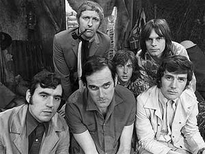

-   

    Image via [Wikipedia](http://en.wikipedia.org/wiki/Image:CarolCleveland.jpg)

Yesterday another WebCamp took place in [Ljubljana](<http://maps.google.com/maps?ll=46.0513888889,14.5055555556&spn=0.1,0.1&q=46.0513888889,14.5055555556 (Ljubljana)&t=h> "Ljubljana") and it was the best \*camp event I've ever been to. Congrats to all involved in making it happen, you guys rawk. For some strange reason though I seem to have done almost nothing but hang out in the hall and only caught little bits and pieces of the talks here and there. Perhaps the most surprising thing that I learned is that **nobody** writes good [software](http://en.wikipedia.org/wiki/Computer_software "Computer software") anymore. Hell, why would you make your [algorithms](http://en.wikipedia.org/wiki/Algorithm "Algorithm") and page generators run faster ... just slap some [caching](http://en.wikipedia.org/wiki/Cache "Cache") on there! First you make it cache all [database](http://en.wikipedia.org/wiki/Database "Database") calls. Then you start saving straight to cache too and sort of make commits to the actual storage happen a bit later when they don't bother the user. If that's not enough you can still just "cache" the whole output of your app in a static html file and serve that. And so on. HELLO guise!? Bad sign (tm) if you need to store the whole output of your software so it runs sufficiently well? O.o What are web developers smoking these days ... I want some. That's the impression I got anyway from so many talks about optimisation and caching ... Another very cool talk, although I wasn't in geek-mode enough to listen in on the whole thing, was by @refaktor who showed some funky simplistic server thingies that can perform [real-time](http://en.wikipedia.org/wiki/Real-time_computing "Real-time computing") communication amongst each other. I did see the demo and it was very pretty. Hope he puts the code and talk somewhere public so I can give it a study some time. I happened to steal two sessions of people's time. The first was a public release of [LazySharer](http://preona.net/) that went alright I guess, some things went wrong but it all turned out well in the end. And in a spur-of-the-moment kind of inspiration I also made a talk where we did nothing but watch stupid and silly youtube videos. We burned through our 20+10 minutes and ate away at half of next talk. Sorry Jure, hope you had enough time to talk about [XMPP](http://www.xmpp.org/ "XMPP").

-   

    Image via [Wikipedia](http://en.wikipedia.org/wiki/Image:Flyingcircus_2.jpg)

Seeming as how stupid videos were a marginal enough success for my tastes I got together some people and we set up a booth of sorts in the hall where we then played [Monty Python](http://www.pythonline.com/ "Monty Python") and other silly videos for the rest of the day. Well actually we sort of got bored with it and then other people started playing whatever they wanted to see. It was great fun. The WebCamp concluded a bit early because there were no more talks people wanted to give and half the public went MIA. So then the real party started because all the boring people had left. Imagine this scene: 30-ish people, two cases of beer, a lot of pizza, 70 sooper chocolate muffins. Yeah it was a blast. Apparently spiking those muffins with extra sugar and cocoa was the best idea we ever had at Preona. People went berserk for those things, eating three or more and stealing them for home consumption. Hell, if all this Synaptic Web stuff doesn't work out for us we'll open a muffin bakery. Later on when almost everybody had left the evening evolved into Hekovnik's first movie night. Inglorious Basterds on a huge LCD and four people on a sofa munching on stuff. Fun times. Although those people having a brainstorming session on the other side of the room were a bit loud at times :P PS: there were three pizzas (out of 40) left over and no muffins (out of 70). I think this is a great achievement.

[![Reblog this post \[with Zemanta\]](http://img.zemanta.com/reblog_e.png?x-id=fb4e45dd-b9c7-4bb3-9e97-b49a591159c9)](http://reblog.zemanta.com/zemified/fb4e45dd-b9c7-4bb3-9e97-b49a591159c9/ "Reblog this post \[with Zemanta]")
