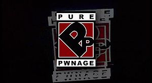

- 

  Image via [Wikipedia](http://en.wikipedia.org/wiki/Image:Purepwnage.jpg)

Hai guise, long time no funky and interesting posting around here.

That's all about to change.

'Cause I've got something incredibly awesome and silly to tell all y'all.

Remember [Pure Pwnage](http://www.purepwnage.com "Pure Pwnage")? That show about a gaming dude called Jeremy otherwise known as _teh_pwnerer_who is followed around by his [noob](http://en.wikipedia.org/wiki/Newbie "Newbie") brother Kyle and they make a show?

Yeah that one, the best fucking internet show ever devised by man. I loved that damn thing!

But then it sort of died, with T-Bone's crash and everything. It also just so happened to [jump the shark](http://en.wikipedia.org/wiki/Jumping_the_shark "Jumping the shark") a little bit even before then. It was much awesomer when everyone still believed Jeremy was Jeremy and Kyle was Kyle and so on. Seriously, it looked totally legit.

Thing was, once they published that they were professionals, alright, doesn't hurt the show and Jeremy was still a pretty heavy [gamer](http://en.wikipedia.org/wiki/Gamer "Gamer") IRL anyway. I mean they had to be to know that many jokes about games. Thing was, they suddenly felt the freedom of not having to be constrained by reality and it degraded the quality a bit.

BUT NO MATTER!

Because NOW, oh yeas, yes!, NOW they're back! And.

it.

is.

fucking.

awesome!

They finally managed to become a proper TV show so the quality of everything is a bit better, but they've retained the good old format of behind-the-camera Kyle and Jeremy his brother and so on. I watched the season premiere last night and I recommend anyone and everyone who's ever played a video game to go download it and give it a good watch.

Unfortunately, yeah, with becoming more proper they've also become moronic about copyright. In the old days you could just go to their site and watch it anywhere in the world. They had a huge worldwide fanbase and they really really took care of us fans methinks. Now you can only watch it from Canada and US or something. A huge waste.

They basically threw away the one thing that made them really popular and successful - openness. But oh well, at least there's piratebay and such.

###### Related articles by Zemanta

- [Pure Pwnage: This is what the nerds' revenge looks like](http://www.nationalpost.com/rss/story.html?id=2667931) (nationalpost.com)

[![Reblog this post \[with Zemanta\]](http://img.zemanta.com/reblog_e.png?x-id=d7ffe976-02e2-41e5-b2d3-79a66ad853bb)](http://reblog.zemanta.com/zemified/d7ffe976-02e2-41e5-b2d3-79a66ad853bb/ "Reblog this post \[with Zemanta]")