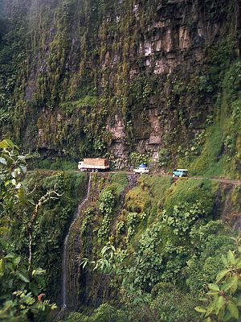

-   

    Image via [Wikipedia](http://commons.wikipedia.org/wiki/Image:Bolivia_Yunga_Road.jpg)

And thus the three day easter weekend is behind us. Finally. Was getting a bit long to be honest. But what's more important than this is what I spent most of my weekend doing --> Videogames and piles upon piles of omnom yummy foods. Mostly [junk foods](http://en.wikipedia.org/wiki/Junk_food "Junk food") like bits of smoked pigs and copious amounts of chocolate ... very little eggs though, that's a bit silly considering easter is supposed to be all about eggs. No matter, food was omnom. Now, how can a guy justify wasting so many hours on something as simple as [videogames](http://en.wikipedia.org/wiki/Video_game "Video game")? Well, I could say I was trying to have fun ... but that's a cop out, way too easy. The most importantest thing is the mechanics of my adventures. The game I was playing was [Richard Burns Rally](http://en.wikipedia.org/wiki/Richard_Burns_Rally "Richard Burns Rally"), known far and wide as being one of the most, if not _the_ most, difficult and realistic rally simulation games. The map I was playing was Mineshaft from Australia, in my humble opinion the hardest fucking map in the whole game. See in most of the maps you drive in some forrest or something and the worst that can happen is you ram a tree or lose time by going a bit wide and over some grass or something. But Mineshaft is different. Most of that damn thing is comprised of a road with a sheer drop cliff on one side and a cliff on the other. It's a bit like trying to rally over the [Yungas Road](http://en.wikipedia.org/wiki/Yungas_Road "Yungas Road") (most dangerous road in the world FYI). So what the fuck are you rambling about Swizec. Just get on with the fucking point already sheesh! Alright alright. :D My point is that ALL I did. For SEVERAL fucking hours. Was. Play. Richard Burns Rally. On. The. Hardest. Map. But why on god's fucking earth would you do something like that? Well, because I could. But the important bit is why I wanted to. The game is insane to play on keyboards and needless to say I never once survived to the end of the map. Out of ~200 plays. I never once finished. Wtf, masochist? No. Through endless repetition and stupid iteration I learned. I learned a whole fucking lot! By the time I got fed up with playing I was habitually achieving mid times several seconds faster than the world record for that stage. Yes, the realistic world record. \*gasp\* \*shocker\* But I still didn't finish, so the quest continues. My point is that this little experience teaches us a lot about life, the universe and everything. **Life is a series of insurmountable obstacles on the road to imminent disaster** And that is all. Remember that. Whenever you are failing in life, you're not failing, you're _learning_. That's what it's all about. The more you fail the better a person you become, those times you dont' fail you haven't learned a single thing. So stop that.

[![Reblog this post \[with Zemanta\]](http://img.zemanta.com/reblog_e.png?x-id=ef748e69-9a88-46da-a6e5-f4d35edc270b)](http://reblog.zemanta.com/zemified/ef748e69-9a88-46da-a6e5-f4d35edc270b/ "Reblog this post \[with Zemanta]")
