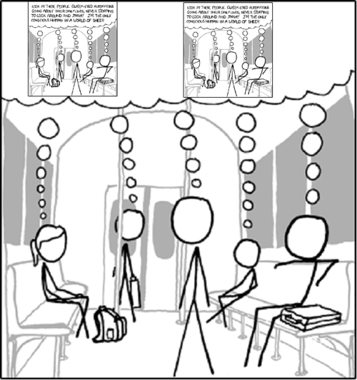

Today I read a nice post about the [6 myths that stand in your way.](http://laz.ly/Nc) And there was one that stood out the most

> **Myth:** There is time
>
>
>
> **Reality:** You have less time now than you have ever had. You have less time now than you had an hour ago. You are nearer to your death than you have ever been. Plan thoroughly, but don’t wait too long before taking action.

And then when you remember that [Steve Jobs](http://www.imdb.com/name/nm0423418/ "Steve Jobs") had a speech devoted almost completely to this notion of memento mori. 

Hell, the Romans came up with the whole memento mori crap far far ago ... I forget how the tradition went, but they used to punch winning generals in the face or something ... or was it that a slave was following them through the whole festivity whispering "memento mori" in their ear. Something like that.

Then there's that tradition in greek weedings (judging from [Big Fat Greek Wedding](http://anyclip.com/my-big-fat-greek-wedding "My Big Fat Greek Wedding")) where the bride is thrown off her chair - just to remind her she's mortal too.

And way back when some smart poetry geek came up with the idea of [Carpe Diem](http://en.wikipedia.org/wiki/Carpe_diem "Carpe diem") (later transformed to [Carpe Noctem](http://en.wikipedia.org/wiki/Carpe_Noctem_%28Angel_episode%29 "Carpe Noctem (Angel episode)") and Carpe Pijem, the slovene version). Again basically the same concept!

Then there's an interesting story I read on a forum once, it happened to a forumite's cousin or somesuch:

> She was a lass, around 23 years of age. Two lovely children, a loving husband, nice house and so on. One day they have a fight over something extremely mundane and boring. She gets pissed off and storms out of the house ... only to be mowed down by a truck.
>
>
>
> To death.

So yeah, I know as [humans](http://en.wikipedia.org/wiki/Human "Human") we like to think we're something special, that each and everyone of us is a special little snowflake unique and wonderful in their own right.

Well you're not. You too will die, today, tomorrow, in an hour, it doesn't matter.

And nothing of value will be lost!

Nothing!

Nobody will care, absolutely nobody.

I think people often forget these things and spend their whole lives doing boring shit they don't care about. Stop that!

For the end, a quote from [Anthony de Mello](http://en.wikipedia.org/wiki/Anthony_de_Mello "Anthony de Mello"):

> Most people, even though they don’t know it, are asleep. They’re born asleep, they marry in their sleep, they breed children in their sleep, they die in their sleep without ever waking up

But that just brings to mind this:

I dunno, just remember that whatever you do, all your life, you're on the verge of imminent death. Never forget.

[![Reblog this post \[with Zemanta\]](http://img.zemanta.com/reblog_e.png?x-id=41235a64-4632-4197-837a-31060887dedf)](http://reblog.zemanta.com/zemified/41235a64-4632-4197-837a-31060887dedf/ "Reblog this post \[with Zemanta]")