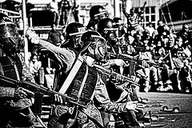

- 

  Image by [Steve Crane](http://www.flickr.com/photos/49503062604@N01/237431962) via Flickr

Because this is a local topic the post is in slovene, apologies to both my international readers.

Zadnje dni ŠOU že kar malo precej najeda z vso propagando okoli malega dela in kako je to oh in sploh konec sveta, pa da sploh ne omenimo ubogih študentekov kako, da ga bomo nasrkali in ne bomo niti za kavico več imeli.

Pa pustimo, da študent sploh ne rabi kavice ampak se na faksu kaj naučit pa zraven en malo štipendije za knjige in kak sendvič.

Ok priznam, odkar sem na faksu še ni minil mesec, ko ne bi več časa zapravil za "službo" kot za študijske zadeve - izvzemši seveda izpitna obdobja potem ko sem se pred kakim letom malce spametoval.

A vseeno podpiram in pozdravljam malo delo, čeprav sem direktor malega startupa sestavljenega izključno iz študentarije. Malo delo bo super.

Zakaj?

Ja ker se nič ne bo spremenilo, samo malo se bo povečal obseg kdo vraga lahko dela in tisti ki delajo bodo imeli kako pravico več. Kurba je ko si dva tedna bolan in zato konec mesca ne morš plačat telefona, ali pa greš na malo dopusteka in magično zmanjka vsega denarja.

Zveni zelo viktorijansko mar ne? Mogoče celo ameriško.

Pfuj in pfej. Amerika in viktorijanstvo sta kul samo za nadbogate, študentarija in reveži se v nobenem primeru nimajo kaj preveč fino. Pri nas pa? Jah študent je car ...

... in tako naj ostane.

Če znaš dobro delat, kar seveda znaš mar ne, sej te močno srbijo omejitve urnih postavk, to valjda pomeni da zdaj zaslužiš bajno več mar ne? Boš po preračunih z malim delom še vedno lahko zaslužil 6000 eurov na leto. In ja, to ravno pade v tisti minimum, da še ne plačaš davkov.

Osebno sem tista leta ko sem zaslužil več kot 6k gagal ko majmun cele dneve in naredil prekleto malo izpitov.

Kar se pa tiče demonstracij ...

Jaz in ŠOU sva opravila. Današnja automagična prijava na nekakšen SMS klub in to da me zdaj kar nekaj spamajo sta bila pika na i. Ne grem se več.

Sem hotel it na demonstracije čist samo tako, za špas, mogoče bi bili pa izgredi in po mojem nisi zares živel dokler nisi bil vsaj enkrat v resnih izgredih - po možnosti v študentskih letih, kasneje ni več fore. Ampak izgredov ne bo, smo preveliki papki.

Ah kje so cajti, ki jih opisujejo stari ljubljančani, ko je študentarija zavojevala fakse in ohromila Ljubljano, da so povedali svoje. Zdaj so demonstracije samo še show in komerciala. Pa kak alkohol več se proda na ta račun.

[![Reblog this post \[with Zemanta\]](http://img.zemanta.com/reblog_e.png?x-id=a3a05ea0-525e-4c09-bf92-94aed194ddb5)](http://reblog.zemanta.com/zemified/a3a05ea0-525e-4c09-bf92-94aed194ddb5/ "Reblog this post \[with Zemanta]")