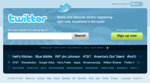

- 

  Image via [CrunchBase](http://www.crunchbase.com)

Lately there has been raging debate in the blogosphere (is that still a word?) around whether [RSS](http://en.wikipedia.org/wiki/RSS "RSS") is dead or not and the fact that it's apparently been dying ever since it was first conceived in 1999 or thereabouts.

Arguments range all the way from the fact that it is useless in light of [Twitter](http://twitter.com "Twitter") and [Facebook](http://facebook.com "Facebook"), that it never managed to jump the gap, that people simply can't use it and that it all looks like RSS readers are being shut off left and right. Signs of great decay left and right, let's abandon the poor thing completely and let it die in peace right?

But there is one very very \\important thing that everybody is missing: RSS is not a user-facing technology. Just like the [semantic web](http://semanticweb.org "Semantic Web"), it was never meant to be something people actually _use_.

RSS is essentially one big hack, a pretty good way of having content delivered to you without specifically going out there and looking for it. Even though, essentially, that's exactly what your RSS reader does. It's got a list of websites it checks every so often and then gets back to you with the results. In that regard it's essentially a bunch of bookmarks, you're just not tending to them yourself. It's just a bit easier for a computer to read xml than a website. With pubsubhubbub the way this is done has changed a little, but no biggie.

Ok, so RSS is a content distribution technology for computers.

Now, we all know that as technologies go, there needs to be that one killer feature that trumps all alternatives right?

Well twitter's got one, the [communication protocol](http://en.wikipedia.org/wiki/Communications_protocol "Communications protocol") is dead simple, simpler than phones. Great!

And facebook's got one too, they're a bit of everything, not very simple, but everyone's got a facebook so you're not leaving any time soon because you're locked. Great!

What does RSS have?

Well, it's got geeks. Lots and lots and lots of hardcore geeks. Did you know geeks produce the most content on [social networks](http://en.wikipedia.org/wiki/Social_network "Social network")? How do you think stuff gets on your twitter and your facebook? Somebody's got to post it there before it can go viral. That someone likely found out via RSS. Sure this can be automated, but then you've just ruined the most \\important part of consuming content via twitter or facebook - the social filtering.

But there's an even more \\important feature to RSS.

**Infinite scalability. Infinite distributability.**

Both twitter and facebook are tied to a single provider. Twitter's servers go down and all you see is a failwhale. No content for you. Imagine, for example, a huge earthquake hits california. Now suddenly both twitter's and facebook's [data centers](http://en.wikipedia.org/wiki/Data_center "Data center") are offline. No content.

But RSS would bravely go on working perfectly. Some sites might not be able to update, but the rest of the world wouldn't even notice a glitch. Everything just works smoothly.

Basically I guess what I'm saying is the same as [Dave Winer](http://scripting.com/stories/2010/09/13/howToRebootRss.html). RSS is here to stay, [somebody](http://lazyreadr.com/) just needs to step up to the plate and make an RSS reader for _people._

###### Related articles by Zemanta

- [No, RSS Is Not Dead, and Neither Are RSS Readers](http://gigaom.com/2010/09/13/no-rss-is-not-dead-and-neither-are-rss-readers/) (gigaom.com)
- [Loic Le Meur, CEO of Seesmic, and I were arguing last week about whether RSS has a future or not. He speaks up for "it has a future" on his blog. Dave Winer today...](http://scobleizer.com/2010/09/13/reboot-rss-readers-sorry-that-train-has-left-the-station/) (scobleizer.com)
- [RSS won't die, but news readers are evolving and becoming more social](http://blog.twingly.com/2010/09/14/rss-wont-die-but-news-readers-are-evolving-and-becoming-more-social/) (twingly.com)
- [The Changing Face of RSS - What the Death of Bloglines Means for the Future of RSS](http://www.plagiarismtoday.com/2010/09/13/the-changing-face-of-rss/) (plagiarismtoday.com)

