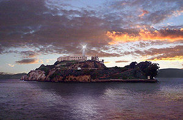

- 

  Image via [Wikipedia](http://commons.wikipedia.org/wiki/File:Alcatraz_Island_Lighthouse.jpg)

Now that it's been a weekend since my return from [the US](<http://maps.google.com/maps?ll=38.8833333333,-77.0166666667&spn=10.0,10.0&q=38.8833333333,-77.0166666667 (United%20States)&t=h> "United States") and I've had plenty of time to get over the cold of epic proportions that hit me on the way to the airport (literally, I was buying and popping fever reducers at the airport before boarding) and I've had plenty of time to compose myself, I can finally write down some thoughts of what I'd seen on my two week journey into the unknown.

At least I thought it was the unknown. Turns out there was no [culture shock](http://en.wikipedia.org/wiki/Culture_shock "Culture shock") to speak of.

Apparently if you watch enough movies and television, or just if you watch as much as I do, the US turns out to be a pretty unsurprising country to visit. I had more surprises visiting the [UK](<http://maps.google.com/maps?ll=51.5,-0.116666666667&spn=10.0,10.0&q=51.5,-0.116666666667 (United%20Kingdom)&t=h> "United Kingdom") or [Italy](<http://maps.google.com/maps?ll=41.9,12.4833333333&spn=10.0,10.0&q=41.9,12.4833333333 (Italy)&t=h> "Italy") and they're practically neighbours.

Everything is just as you'd expect:

- the roads are incredibly wide
- the roads have way too many lanes
- the cars are stupidly big
- everything is insanely cheap

That last point in particular was quite surprising. The US markets itself as the land of plenty, the land of supple opportunity and the land of the rich. Well, from a European's point of view, the US is pretty much a big [discount store](http://en.wikipedia.org/wiki/Discount_store "Discount store"). You enter the country and _everything_ is sold at roughly a 30% to 40% discount depending on the day.

And the cheapening effect doesn't stop at the Dollar vs. Euro dynamic. Because of the bigger economy and cheap labor (I imagine) stuff is just cheaper in general. For example a sushi lunch in [Ljubljana](<http://maps.google.com/maps?ll=46.0513888889,14.5055555556&spn=0.1,0.1&q=46.0513888889,14.5055555556 (Ljubljana)&t=h> "Ljubljana") would cost three times as much as it did in the US, while being at least half smaller.

It's pretty insane.

Or like I bought a pair of jeans at a pretty reasonable price and upon getting home my sister tells me what I bought was one of the top brands super-expensive type of jeans. O.o

Ok, so I guess there's a bit of culture shock. The cheapness of everything.

There were, however, a few more odd little tidbits that I noticed:

- americans aren't as fat as you'd think, on average they're quite europe-like
- all doors open the wrong way (fire safety or something)
- there is a severe lack of automatic doors everywhere
- some stores still give you hand-written receipts
- very few stores have modern computer-like cash registers
- almost nobody takes [debit cards](http://en.wikipedia.org/wiki/Debit_card "Debit card") as payment
- all store clerks are SOOPER nice, it was surprising
- a lot of "natives" don't speak english

That's about it, I should write some more about the actual startup scene, the companies we visited and what we've seen of the US from that perspective; but that's best reserved for Preona's company blog.

Oh and while I did go see [Alcatraz](<http://maps.google.com/maps?ll=37.8264,-122.4224&spn=1.0,1.0&q=37.8264,-122.4224 (Alcatraz%20Island)&t=h> "Alcatraz Island") and it was very fucking incredibly rainy that day, I didn't get to see the Golden Gate Bridge, which is just stupid. But anyways, here are some random pics from my shiny new iPhone4.

PS: Cheesecake Factory has the best fucking cheesecake (or cake in general) that I have ever had the pleasure of tasting!

