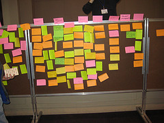

- 

  Image by [Geodog](http://www.flickr.com/photos/35034356008@N01/2518202548) via Flickr

Perhaps everyone knows about this problem already and I've just been very fortunate, or maybe it's one of those things that happens so rarely nobody really feels the need to talk about it. Or any other number of reasons why I have yet to notice a blog about why clients should have clearly defined deadlines as well as the person (or company) doing the work.

Over the past few months I've been working on a small side-project that was supposed to take me about two weeks of night-time work and I didn't expect the whole thing to last any longer than a month. It was supposed to be some quick cashflow my way so I could get myself out of the startup money rut for a bit.

The first clue that something was fishy was that the deadline in the contract we signed was set up about two months later than I thought it should be. But that's alright, from previous work with both the client and the particular client's client I knew that these people have a sluggish turnaround rate and it takes them a bit longer than usual to send materials and so on.

Also every good project manager leaves a lot of buffer room.

I completed all of my work, even with changed specs and a little bit of bloat almost exactly on target (the deadline they set). Because of the initial delay in materials and my having started exams at college I think I missed the deadline by about three days. No biggie, getting materials a month later than anticipated will do that.

Now it's two months later than the deadline.

The work has been done so long ago I can't even recollect with accuracy what the project is about and what I'm supposed to do when it gets approved.

The results have yet to be approved at all.

I am still waiting for a few materials that go on the website.

And there is a big hiccup that happened in a part of the project that is mostly out of my control, but most certainly out of the budget and specs for this particular touchup project we were doing. Officially the approval is on hold because of that particular hiccup. But it's been hanging on it for the past month and a half.

Because our initial agreement was you do X and we give you Y amount of money I'm in a bit of a pickle. It's not that I've exactly done X+Z, it's more that hey, getting a few hundred euro for two weeks of work and a month-long turnaround doesn't sound too bad.

However a few hundred euro for a turnaround of five months is _horrible_!

Anyway, I've learned my lesson. Next time I'm doing contract work there will be a clause in the contract for the biggest gap between end-of-work and client-approval.

What do you think, should such clauses be in contracts?

###### Related articles

- [Your deadline or mine?](http://www.jondale.com/blog/2010/10/deadlines.html) (jondale.com)
- [Can This Client Relationship Be Saved? Tips to Nurture Your Client Relationship to Build Trust, Loyalty and Business](http://www.livingstonbuzz.com/2010/11/05/can-this-client-relationship-be-saved-tips-to-nurture-your-client-relationship-to-build-trust-loyalty-and-business/) (livingstonbuzz.com)
- [Jessie: Clients From Hell : Client: "We went ahead and copied your signature...](http://clientsfromhell.net/post/1217295787/client-we-went-ahead-and-copied-your-signature) (clientsfromhell.net)
- [Defining Project Failure](http://regulargeek.com/2010/11/08/defining-project-failure/) (regulargeek.com)
- [Project Managers, Not Calendar Monkeys](http://weblog.muledesign.com/2010/10/project_managers_not_calendar.php) (weblog.muledesign.com)

