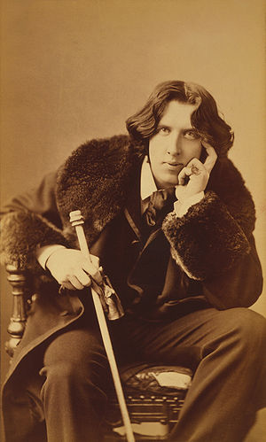

- [](http://commons.wikipedia.org/wiki/File:Oscar_Wilde_3g07095u.jpg)

  Image via [Wikipedia](http://commons.wikipedia.org/wiki/File:Oscar_Wilde_3g07095u.jpg)

On Monday I got a little bored at class. This is something that is likely to happen when you're stuck at classes for nearly the whole day. During a break a classmate of mine showed me something cool. It was a Java applet that used genetic [algorithms](http://en.wikipedia.org/wiki/Algorithm "Algorithm") (we think it was just basic [evolution](http://en.wikipedia.org/wiki/Evolution "Evolution")) to create a model of a car that can travel over rugged terrain ... Actually thanks to Zemanta I found the link -> [Go here for a very cool genetic algorithm demo](http://www.qubit.devisland.net/ga/) This gave me a cool idea to retry making an algorithm I was making a year ago in [Lisp](http://en.wikipedia.org/wiki/Lisp_%28programming_language%29 "Lisp (programming language)"). Because wi-fi wasn't working I wrote it in python this time, simply because I don't need to reference documentation to write python. So I made something cool. (I think) In an hour of solid hacking I created a simple evolutionary algorithm that given enough time can create pretty much any piece of text by performing random [mutations](http://en.wikipedia.org/wiki/Mutation "Mutation") and breeding strings together. My classmates can verify that it only took an hour. Sure, nothing very impressive on a grand scale of things. I mean, what's cool about taking a bunch of random characters and applying random transformations to them to create a known piece of text right? Well I don't know, but my nerd side finds it incredibly satisfying. Anyway I tried it with [Oscar Wilde's Amor Intellectualis](http://en.wikisource.org/wiki/Amor_Intellectualis). You can see the whole code on [github](https://github.com/Swizec/random-coding/blob/master/evolve-text.py). To make this post about a little bit more than just geek bravado, I'm going to try explaining why I believe the algorithm works at all and what makes it pretty successful. Then I'm going to explain a better approach that maybe I will implement some day.

## How?

Ok so the basics of evolution algorithms are pretty simple. You take a population of random stuff. With every generation you mutate the members, perform breeding amongst the best members and remove the worst members from the population. Yep, pretty much like natural selection+evolution in nature. Obviously this means that choosing a proper breeding and [fitness functions](http://en.wikipedia.org/wiki/Fitness_function "Fitness function") is crucial here. The mutation function isn't very interesting ... and in fact as I discovered it's almost better if you don't have it at all. The real reason it's usually there is because it helps the algorithm get out of local minimums.

```
def mutate(a):
    return "".join([random.choice(ALPHABET) if abs(random.random()-0.5) < MUTATE_CHANCE else k for k in a])
```

Basically _mutate_ just goes through the string and [randomly](http://en.wikipedia.org/wiki/Randomness "Randomness") changes characters, if some event with a low chance of happening occurs.

```
def distance(a, b):
    return sum([1 if a[i]!=b[i] else 0 for i in range(len(a))])
```

Distance between strings is my fitness function. It is roughly based on my understanding of Leiningen distance. It simply counts the number of characters that differ between two strings. Very basic stuff.

```
def compete(population):
    population.sort(key=lambda a: distance(a, TARGET))
    return population
```

My compete function is pretty basic as well. Because of python's awesomeness and because my fitness function returns a simple integer, I can simply sort the population by distance. Lovely.

```
def breed(a, b):
    if random.random()-0.5 < BREED_CHANCE:
        s = random.randint(0, len(a)-10)
        e = s+random.randint(1, BREED_MAX_CHUNK)
        c =  a[0:s]+b[s:e]+a[e:]
        return c
    else:
        return mutate(b)
```

The breed function is where it gets interesting and I firmly believe the way I implemented this, is the reason the algorithm performs as well as it does ... it's also probably the reason why it doesn't perform better :) As you can see what I'm doing here is I'm taking a string and replacing a random chunk of it with _the same_ random chunk from a different string. The key thing here is that I'm _not_ shuffling things around. What this does is that it preserves good candidates in a roughly good state. For example, if you're at only a single character difference from the target text, this type of breeding assures that nothing but that single character will be changing. Also of interest might be how I choose whom to breed. Because the breeding function basically clones a part of a worse subject into a part of a better subject (due to the way I'm calling it) what I do is I choose the best 20 members and breed the best 60 members with them. Roughly this ratio seems to produce the best results. Oh and I had problems with inbreeding. It's funny, but if the population was too small and not enough members are breeding what happens is that every member in the population becomes identical, while none of them match the target. Guess all there's something to all those hillbilly jokes :D

## Performance

I haven't really put this algorithm through its paces, but I was pleasantly surprised when it only took 10 generations to evolve a [simple sentence](http://en.wikipedia.org/wiki/Simple_sentence "Simple sentence") and only about 150 generations to create a stanza of Hamlet. The Oscar Wilde poem mentioned earlier is taking a bit longer. After 1000 generations it seems to be mostly prancing around the 5-8 differences range and showing a general downward trend. The lowest peak I saw was at 4. It will probably finish eventually, but perhaps some tweaking of the settings is needed. At the time of writing the algorithm has managed to turn this:

```
llajC
beq'abvnM.pvvTSEjl -S
c ue-v,ub,
lWoqf'nmhpojfWNNufyv-EywDCO,m:ayu.fqOMTbew.hCyiOkp:vlgSffDFun.nyiM'np bwlkbkj'EyST.kN.li -og
EeiqctEi.aSCwcjNSwmpnEamhoeODSc.
,wltnOvMN:oprSbi,CobNh-
iyw..hbpF-NNk'fusCtgtT.upmetwAjenlWOsAEg
AncoilDSvAO.DmMoiyFttAawTiCjaNu
asoCtynkhO-CoDdWWW,gE
iOwuk.yFS v
Nmdqtvs'fgiAS,cWtwOotm:
r,dt,FNqen:f-
y,Aa, pMNrDM
EOFFgqjM
MwmtldkD Sb.eq'D:ncc-vdvkpTme,:,'jDabdnNS'p'bFT
gWhudWprFpFywAh.bdCWOwcNk-fbou,,gWosvfTyFhrkACd CrhfbrDN

oMw'cEfiEcqpqS
pTdpyFT,u',TEl hmhskd,'jrAs
kgOaetibdEEfqaAyd,vhh.s
dp'Wicr: uMfa'Wl,f,WEdumCfgEDgqfhhFfDu:mnbvM'iAWjSw :
hrb-FltrDkt'atC
```

Into this:

```
Oft have be trod the vales of Castaly
And heard sweet notes of sylvan music blown
From antique reeds to common folk unknown:
And often launch
d ou  bark upon that sea
Which the nEne Muses hold in empery,
And ploughed free furrows through the wave and foam,
Nor spread reluctant sail for more safe home
Till we had freighted well our argosy.

Of which despoiled treasures these remain,
Sor:ello's passion, and the honied line
Of young Endymion, lordly Tamburlaine
Driving his pampered jades, and more than these,
The seven-fold vision of the Florentine,
And grave-browed Milton's solemn harmonies.
```

## Better idea

Since this simple hack got me interested in this field, I think I've come up with an even better way of creating texts. One that could perhaps even be capable of creating works of art not known in advance and thus become actually a useful implementation of an evolution algorithm. The general idea is such: instead of mixing around random characters and comparing them to a text. What if we would first use this same algorithm to generate words roughly fitting the English syllabic structure. Then we could start putting those words together using a similar principle as I've used here. Just make sure when breeding you are working on the level of words. Then your fitness function basically checks for proper poetic structure. Voila! Not sure that would be at all useful, but it might just be something pretty cool and nerdy to make some day. Comments regarding the suggested algorithm especially wanted!

###### Related articles

- [Genetic algorithm demo: finding optimal vehicle design (in Flash)](http://www.qubit.devisland.net/ga/) (qubit.devisland.net)
- [Robots designed by genetic algorithms](http://www.boingboing.net/2010/11/30/robots-designed-by-g.html) (boingboing.net)
- [What problems have you solved using genetic algorithms/genetic programming?](http://stackoverflow.com/questions/1538235/) (stackoverflow.com)

[](http://www.zemanta.com/ "Enhanced by Zemanta")