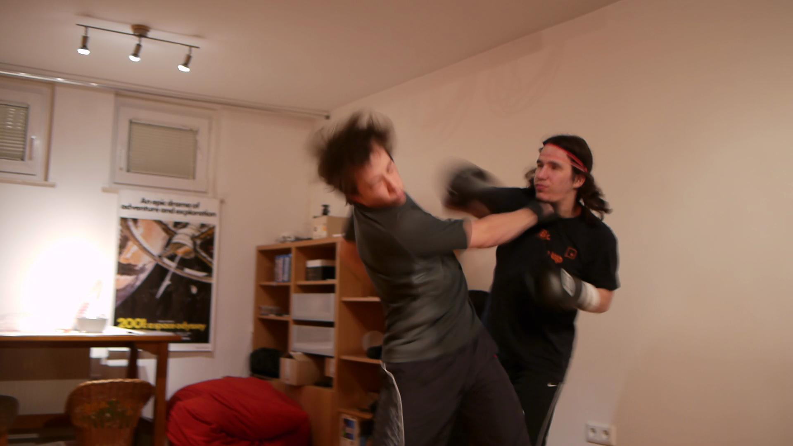

A few weeks ago a debate flared up between a mate of mine and myself. Who would win in a fight? A karateist or a classical boxer? It went on and on and just would not fucking die. It's an interesting debate that. Right up there with tiger vs. bear, narwhal vs. unicorn ... On Friday we decided to simply try.  Sure, we're both noobs. I've been dabbling in boxing for about a year with several pretty long hiatuses, he's been doing karate for something like 5 months. Also, I haven't been to practice for a month now because of exams and crap. Naturally no such fight is complete without female spectators with a camera. D'oh. All in all ... I lost. The fact that getting punched in the face without boxing gloves kind of hurts helped, him being 10 kilo heavier didn't help, my complete lack of good form ... sucked ... and since I'm much shorter than he is there was the added problem of just how bloody difficult he was to reach. Stupid bastard. Pretty much the only two things I had going for me was that our practice includes full contact, his does not so being actually punched in the face was something completely new for him, and as we discovered later, my reflexes are much better. He left many punches go unpunished, my retribution was swift and immediate. Also legs were surprisingly unproblematic. Onwards to the framegrabs! (since I'm not allowed to share the video due to poor photographical quality because Some Women (tm) can't handle technology) \[caption id="" align="alignnone" width="500" caption="Best moment; I threw a good cross, he hit my chin just as his head thrashes about"]\[/caption] \[caption id="" align="alignnone" width="500" caption="Lovely blocked kick"]\[/caption] \[caption id="" align="alignnone" width="500" caption="Standing off across the "]\[/caption] \[caption id="" align="alignnone" width="500" caption="Think I managed to duck for this one"]\[/caption] \[caption id="" align="alignnone" width="500" caption="Something ... or another"]\[/caption] \[caption id="" align="alignnone" width="500" caption="Bad form is bad! Arms are supposed to be on my chin"]\[/caption] \[caption id="" align="alignnone" width="500" caption="Hard to say whose form is worse here"]\[/caption] \[caption id="" align="alignnone" width="500" caption="And the kick that ended it all in the third round"]\[/caption] \[caption id="" align="alignnone" width="500" caption="It hurt so bad"]\[/caption] For the record, a LOT more punches were thrown, the successful ones mostly from him ... but blurry framegrabs are blurry.

###### Related articles

- [Punch It Out: Aerobarre, Where Boxing Meets Ballet](http://www.fitsugar.com/Boxing-Meets-Ballet-New-Fitness-Trend-Aerobarre-14185896) (fitsugar.com)

